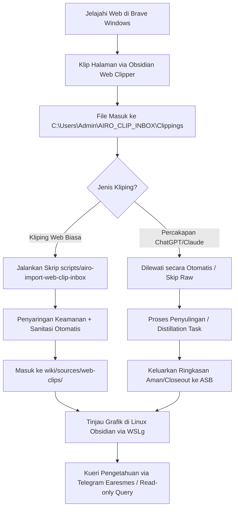

# Panduan Alur Kerja Pemilik: Obsidian & LLM Wiki

Dokumen ini mendefinisikan panduan operasional harian, tata kelola, dan batasan alur kerja bagi pemilik sistem dalam menggunakan ekosistem **AIRO Second Brain (ASB)**.

---

## 1. Arsitektur Akhir (Final Architecture)

- **Repositori Kanonik**: `/home/egitaristorandas/AI_WORKSPACES/airo-second-brain` di WSL Ubuntu.
- **Antarmuka Visual (Visual Cockpit)**: Aplikasi Linux asli Obsidian dijalankan via WSLg dengan membuka path repositori kanonik lokal.
- **Browser Staging**: Brave Browser di Windows host.
- **Kliping Web Staging**: Folder Windows lokal `C:\\Users\\Admin\\AIRO_CLIP_INBOX\\Clippings` (WSL: `/mnt/c/Users/Admin/AIRO_CLIP_INBOX/Clippings`).
- **Skrip Importir**: `scripts/airo-import-web-clip-inbox` (memindahkan berkas kliping aman secara otomatis ke `wiki/sources/web-clips/`).
- **Kueri Baca-Saja (Read-Only)**: `scripts/airo-wiki-query-readonly` yang dikonsumsi oleh Hermes/Earesmes untuk menjawab pertanyaan pemilik di Telegram.

---

## 2. Mengapa Windows Obsidian Tidak Bisa Membuka Vault ASB Kanonik

- **Kesalahan EISDIR**: Windows Obsidian yang mencoba mengakses path WSL secara langsung menggunakan jalur UNC (`\\wsl.localhost\Ubuntu\...`) atau *mapped network drive* (`Z:\...`) mengalami kegagalan watch pada direktori rekursif oleh kernel Windows (*fs.watch* pada MUP/P9NP).
- **Keputusan**: Windows Obsidian dinonaktifkan dari akses langsung ke repositori kanonik ASB. Satu-satunya vault visual yang sah dan aman adalah menggunakan **Linux Obsidian** asli yang berjalan secara native di dalam WSL Ubuntu melalui grafis WSLg.

---

## 3. Cara Membuka Linux Obsidian

Jalankan perintah berikut di terminal WSL Ubuntu pemilik:

```bash
# Meluncurkan Linux Obsidian pada path repositori kanonik ASB
obsidian /home/egitaristorandas/AI_WORKSPACES/airo-second-brain
```

Atau jalankan dari Windows Command Prompt/PowerShell menggunakan wrapper WSL:

```cmd
wsl.exe /usr/bin/obsidian "/home/egitaristorandas/AI_WORKSPACES/airo-second-brain"
```

---

## 4. Cara Membuka Tampilan Grafik (Graph View)

1. Setelah Obsidian terbuka, tekan tombol kombinasi pintasan: **`Ctrl + P`** untuk membuka Command Palette.
2. Cari dan pilih opsi: **`Open graph view`**.
3. Di dalam panel pengaturan grafik sebelah kanan, aktifkan penyaringan berkas dengan mengetik pada kolom filter:
   ```text
   path:wiki
   ```
4. Grafik hanya akan menampilkan keterkaitan antar konsep di dalam wiki Second Brain.

---

## 5. Cara Menggunakan Brave Web Clipper

1. Pasang ekstensi resmi **Obsidian Web Clipper** di Brave Browser Windows.
2. Atur target penyimpanan ke vault staging **`AIRO_CLIP_INBOX`**.
3. Pada setelan template default Web Clipper, pastikan setelan berikut terisi:
   - **Vault**: `AIRO_CLIP_INBOX`
   - **Note location/folder**: `Clippings` (atau kosongkan agar langsung masuk ke root inbox)
   - **Note name**: `{{title}}`
4. Untuk menangkap halaman web, klik ikon ekstensi Web Clipper di Brave lalu pilih **Save** atau **Add to Obsidian**.

---

## 6. Alur Kerja Harian Pemilik (Daily Owner Workflow)



1. **Jelajahi & Klip**: Jelajahi web di Windows Brave → Klip halaman → Berkas mendarat di `C:\\Users\\Admin\\AIRO_CLIP_INBOX\\Clippings`.
2. **Jalankan Impor**: Jalankan skrip importir di terminal WSL:
   ```bash
   ./scripts/airo-import-web-clip-inbox
   ```
3. **Penyulingan Obrolan**: Kliping percakapan mentah akan dilewati secara otomatis. Lakukan tugas penyulingan manual sebelum mempromosikan ringkasannya ke wiki.
4. **Tinjau & Kueri**: Buka grafik di Linux Obsidian untuk meninjau relasi konsep, atau lakukan tanya-jawab pengetahuan baca-saja via Telegram `/wiki query <pertanyaan>`.

---

## 7. Kebijakan Penyulingan Kliping Percakapan (Distillation Policy)

Kliping percakapan mentah (*raw conversation transcript*) dari ChatGPT/Claude **dilarang keras** dimasukkan langsung ke dalam ASB untuk menghindari kebocoran data sensitif dan menjamin kebersihan struktur wiki.

- **Konten yang boleh diimpor (setelah disuling)**:
  - *Session closeout* (catatan penutupan sesi).
  - *Decision candidate* (kandidat keputusan operasional).
  - *Task carry-over* (tugas lanjutan).
  - *Source metadata* (metadata asal sumber).
  - *Safe summary* (ringkasan aman).
  - Berkas baru wajib diberi status awal: `status: draft` atau `status: proposal`.
- **Konten yang dilarang diimpor**:
  - Transkrip obrolan mentah penuh (*full raw transcript*).
  - Kunci API, token, atau informasi rahasia (*secrets*).
  - Data kredensial.
  - Badan email penuh (*full email body*).
  - Kode OTP/keamanan.

---

## 8. Tindakan yang Dilarang (Forbidden Actions)

- **JANGAN** membuka repositori ASB kanonik menggunakan Windows Obsidian (baik lewat jalur UNC `\\wsl.localhost` maupun *mapped network drive* `Z:\...`).
- **JANGAN** menyalin secara manual transkrip obrolan mentah ChatGPT/Claude ke dalam ASB.
- **JANGAN** men-stage atau mengomit berkas masukan mentah yang berada di folder transisi `C:\\Users\\Admin\\AIRO_CLIP_INBOX` ke dalam Git repositori ASB.
- **JANGAN** menganggap catatan wiki derivatif sebagai otoritas kebenaran yang lebih tinggi daripada dokumen kanonik asli.

---

## 9. Pemecahan Masalah (Troubleshooting)

- **Obsidian WSLg Tidak Terbuka**: Periksa apakah sistem grafis WSLg host Windows mengalami crash. Jalankan perintah `wsl --shutdown` di Windows PowerShell untuk me-restart subsistem WSL dan coba luncurkan kembali Linux Obsidian.
- **Skrip Impor Gagal Mengimpor**: Pastikan tidak ada bentrokan kunci *writer lock* di `/tmp/airo-second-brain-runtime.lock` yang tersisa dari kegagalan proses sebelumnya. Hapus berkas kunci tersebut secara manual jika aman.

---

## 10. Catatan Penarikan (Rollback Notes)

Apabila pembaruan di kemudian hari merusak repositori, gunakan perintah git revert untuk memulihkan keadaan ke commit stabil terakhir, atau jalankan perintah:

```bash
git restore wiki/
```

untuk membatalkan perubahan tidak staged di folder wiki Second Brain.
