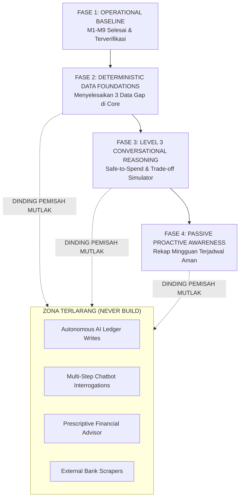

# AIRO Finance Assistant — Roadmap & Phasing Strategy (v1.0)

- **Project**: `AIRO_FINANCE_LAB`
- **Document ID**: `AIRO_FINANCE_ASSISTANT_ROADMAP_V1`
- **Status**: `LOCKED_ROADMAP`
- **Date**: `2026-09-11`
- **Task**: `AIRO_FINANCE_ASSISTANT_CAPABILITY_MAP_V1`
- **Role**: `AIRO Sync Planning`
- **Mode**: `DESIGN_ONLY`
- **Source of Truth**: `AIRO_FINANCE_ASSISTANT_CAPABILITY_MAP_V1`, `AIRO_FINANCE_REASONING_BOUNDARY_V1`

---

## 1. Strategi Pengembangan: Prinsip Bertahap & Berbasis Bukti

Untuk memastikan pengembangan AIRO Finance Assistant tidak terjebak dalam perangkap kompleksitas EAB, roadmap diatur dengan prinsip:

$$	ext{Evidence (Bukti Nyata)} \longrightarrow 	ext{Decision (Keputusan Terkunci)} \longrightarrow 	ext{Implementation (Kode Minimal)}$$

Setiap fase harus menyelesaikan kriteria penerimaan (*Acceptance Criteria*) dan diverifikasi melalui runtime evidence sebelum fase berikutnya dibuka.

---

## 2. Peta Fase Pengembangan (*Phased Evolution Roadmap*)



---

### FASE 1: OPERATIONAL BASELINE (COMPLETED)
- **Status**: **LULUS & TERKUNCI (100% DONE)**
- **Cakupan yang Selesai**:
  - M1: Finance Core relational engine (5 tabel, ACID, audit logs).
  - M2: Web Dashboard Cockpit (Overview, saldo, manual transaction entry).
  - M3: Telegram Quick Capture (Single-turn regex, sane defaults, 1-click cancel).
  - M4: Daily Usage Validation (Cases A-J, 100% success rate).
  - M5: Intelligence Boundary Design (Kunci Zero Writes Rule).
  - M6: Finance Intelligence Read Layer (5 read models, zero LLM dependencies).
  - M7: Hermes Read Adapter (4 intents terpetakan, zero writes).
  - M8: Hermes Usage Validation (Evaluasi Cases 1-5, 100% akurasi faktual).
  - M9: 7-Day Real Usage Trial (7/7 hari aktif, 21 transaksi riil, zero balance drift).

---

### FASE 2: DETERMINISTIC DATA FOUNDATIONS (PRIORITAS UTAMA BERIKUTNYA)
*Tujuan: Membangun fondasi data matematis di Finance Core untuk menutup 3 kesenjangan Level 3.*

- **Milestone 2.1: Multi-Account Transfer Syntax di Quick Capture**
  - Menambahkan dukungan regex transfer pada `SimpleTransactionParser`:
    `"trf 500k bca ke mandiri"` $
ightarrow$ mutasi ganda terpadu (Debit BCA, Kredit Mandiri) dengan 1 kartu konfirmasi.
- **Milestone 2.2: Committed Expenses & Recurring Tracking**
  - Menambahkan kolom `is_recurring BOOLEAN DEFAULT FALSE` dan `frequency TEXT` pada skema `transactions`, atau tabel sederhana `fixed_obligations`.
  - Mengisolasi kewajiban bulanan tetap (sewa, listrik, internet, asuransi) dari belanja fleksibel (*discretionary*).
- **Milestone 2.3: User Financial Profile Parameters**
  - Menyimpan konfigurasi deterministik sederhana:
    - `payday_day`: Tanggal siklus gajian rutin (misal: tanggal 25).
    - `safety_floor`: Batas saldo cadangan minimal yang tidak boleh disentuh (misal: Rp2.000.000).
- **Kriteria Keberhasilan Fase 2**:
  - Test suite transfer berhasil dengan audit log utuh.
  - Data komitmen tetap dan profil kas tersimpan di SQLite tanpa merusak 5 tabel MVP.

---

### FASE 3: LEVEL 3 CONVERSATIONAL REASONING (REASONING LAYER EXPANSION)
*Tujuan: Membuka kemampuan Hermes menjawab pertanyaan daya tahan dan simulasi belanja tanpa halusinasi.*

- **Milestone 3.1: Safe-to-Spend & Payday Runway Read Models**
  - Mengembangkan fungsi kalkulator matematis murni di `insights.py`:
    $$	ext{Safe-to-Spend} = 	ext{Saldo Likuid} - 	ext{Komitmen Tersisa Bulan Ini} - 	ext{Safety Floor}$$
    $$	ext{Payday Runway} = rac{	ext{Saldo Likuid Aktif}}{	ext{Rata-rata Burn Rate Harian}}$$
- **Milestone 3.2: Hermes Adapter Integration & Intent Mapping**
  - Memetakan pertanyaan Level 3 ke read model baru:
    - *"Berapa uang aman saya untuk jajan minggu ini?"* $
ightarrow$ panggil `calculate_safe_to_spend()`.
    - *"Apakah saldo cukup sampai gajian?"* $
ightarrow$ panggil `calculate_payday_runway()`.
  - Menyertakan klausul deklarasi asumsi eksplisit pada setiap jawaban.
- **Milestone 3.3: Trade-off & Purchase Impact Simulator ("What-if")**
  - Endpoint kalkulasi simulasi in-memory:
    `simulate_purchase(amount=1500000)` $
ightarrow$ menghitung dampak nominal terhadap sisa uang aman dan sisa hari runway.
  - Hermes menyajikan fakta dampak angka, dan secara kaku mengeksekusi *Refusal Rule R1* (menolak memutuskan "boleh/tidak").
- **Kriteria Keberhasilan Fase 3**:
  - 100% hasil perhitungan matematis cocok terhadap ledger.
  - Nol kasus halusinasi atau saran preskriptif yang melanggar batasan.

---

### FASE 4: PASSIVE PROACTIVE AWARENESS (CADENCE ASSISTANCE)
*Tujuan: Memberikan kesadaran berkala tanpa menimbulkan polusi notifikasi.*

- **Milestone 4.1: Sunday Evening Weekly Recap**
  - Skrip mandiri terisolasi yang mengagregasikan pengeluaran 7 hari terakhir setiap Minggu pukul 20:00 WIB.
  - Mengirimkan 1 pesan Telegram ringkas berisi: total belanja minggu ini, perbandingan vs minggu lalu, dan kategori terbesar.
  - **Sifat**: Pasif, satu arah, tanpa tombol interogasi.
- **Milestone 4.2: Dashboard CSV Export Button**
  - Tombol unduh data transaksi bulanan ke format CSV untuk pencadangan mandiri Owner.
- **Kriteria Keberhasilan Fase 4**:
  - Notifikasi terkirim tepat waktu sekali seminggu tanpa konsumsi CPU di luar jadwal eksekusi.

---

## 3. Zona Terlarang (*The "Never Build" List*)

Daftar kapabilitas berikut **DIKUNCI PERMANEN DI LUAR SISTEM** dan dilarang diajukan ke roadmap:

1. ❌ **Autonomous AI Agent Terpisah**: Menolak pembuatan bot terpisah selain bot pencatat dan persona tunggal Hermes.
2. ❌ **Robo-Advisor & Prescriptive Life Advice**: AI tidak boleh menentukan apakah Owner "layak" atau "boleh" membeli barang impiannya.
3. ❌ **Autonomous Ledger Writes**: AI tidak memiliki izin mutasi data buku besar secara mandiri dalam kondisi apapun.
4. ❌ **Conversational State Machine Loops**: Tidak ada kuis interogasi berulang bergaya EAB untuk mengisi data.
5. ❌ **Background Web / Email Scrapers**: Tidak ada pemindaian email bank atau scraping mutasi rekening pihak ketiga.
6. ❌ **Live Ticker / Spekulasi Investasi**: Tidak ada integrasi harga saham, kripto, atau kalkulator portofolio spekulatif.

---

## 4. Matriks Gerbang Keputusan (*Milestone Decision Gates*)

```text
+-------------------+      +-------------------+      +-------------------+
| GERBANG FASE 1-2  |      | GERBANG FASE 2-3  |      | GERBANG FASE 3-4  |
| Trial M9 PASS     | ---> | Data komitmen     | ---> | Level 3 Reasoning |
| Regression 0      |      | & profil kas siap |      | terbukti 100%     |
| Owner Setuju      |      | di Finance Core   |      | akurat faktual    |
+-------------------+      +-------------------+      +-------------------+
```

- Jika suatu gerbang tidak terpenuhi, penghentian (*STOP*) wajib dilakukan dan sistem kembali ke mode evaluasi bukti.
