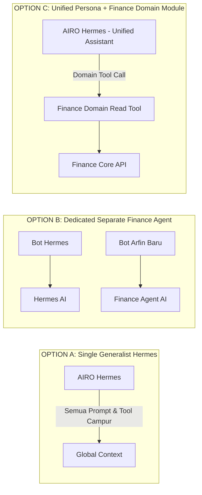
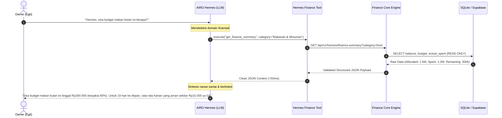

# AIRO Finance Lab — Hermes Architecture Decision (v1.0)

- **Project**: `AIRO_FINANCE_LAB`
- **Document ID**: `AIRO_FINANCE_HERMES_DECISION_V1`
- **Status**: `LOCKED_ARCHITECTURE_DECISION`
- **Date**: `2026-09-11`
- **Task**: `AIRO_FINANCE_LAB_M5_INTELLIGENCE_BOUNDARY_DESIGN_V1`
- **Role**: `AIRO Executor Agent`
- **Mode**: `DESIGN_ONLY`

---

## 1. Context & Problem Statement

Ekosistem AIRO telah memiliki asisten utama berbasis Telegram yaitu **AIRO Hermes (Earesmes)**. Di sisi lain, AIRO Finance Lab membutuhkan lapisan penalaran cerdas (*Intelligence Layer*) agar Owner (Egit) dapat berkonsultasi mengenai kesehatan finansial, batas anggaran, dan pola pengeluaran secara natural.

Pertanyaan arsitektural mendasar:
> **Apakah AIRO Finance harus memiliki bot/agent AI mandiri terpisah, menjadi kemampuan internal di dalam AIRO Hermes, atau arsitektur hybrid?**

Keputusan ini sangat krusial guna menghindari duplikasi infrastruktur, konflik token Telegram, dan fenomena kepribadian bot ganda yang membingungkan Owner.

---

## 2. Evaluation of Architectural Options

Tiga opsi arsitektur dievaluasi berdasarkan kriteria teknis dan operasional:

### 2.1 Matriks Analisis Komparatif

| Dimensi Evaluasi | Opsi A: Single Hermes Generalist | Opsi B: Dedicated Finance Agent Mandiri | Opsi C: Unified Hermes + Finance Domain Module |
|---|---|---|---|
| **Kompleksitas Teknis** | Rendah (Monolit prompt) | Sangat Tinggi (Dua runtime, dua worker, token ganda) | **Sedang & Terisolasi (Modular Tools)** |
| **Beban Pemeliharaan** | Tinggi (Prompt bloat & polusi konteks global) | Sangat Tinggi (Sinkronisasi status lintas bot) | **Rendah (Clean interface boundary)** |
| **Pengalaman Harian Owner** | Kurang spesifik, rentan lupa konteks finansial | Buruk (Owner bingung harus chat ke bot mana) | **Terbaik (Satu pintu obrolan akrab dengan Hermes)** |
| **Risiko Pola EAB** | Sedang | **Sangat Tinggi (Mengulang arsitektur EAB Arfin)** | **Sangat Rendah (Nol IPC rumit, stateless tool)** |
| **Kepatuhan Aturan Telegram** | Sesuai aturan 1 bot token | Rawan bentrok `getUpdates` (Pelanggaran AGENTS.md) | **Patuh mutlak pada single bot gateway** |

---

## 3. Definitive Architectural Decision: OPTION C

### Keputusan:
> **DIPILIH: OPTION C — Finance Specialist Module di bawah AIRO Hermes.**

### Rujukan Desain:
1. **Identitas Tunggal di Mata Owner**:
   Owner hanya berinteraksi dengan satu entitas asisten pribadi di Telegram, yaitu **AIRO Hermes**. Hermes mengenali domain finansial sebagai salah satu keahliannya melalui alat bantu domain (*domain tool*).
2. **Isolasi Domain Finansial**:
   Logika bisnis, skema database, dan kalkulasi saldo tetap berada 100% di dalam package `airo_finance_core`. Hermes tidak menyentuh database SQL secara langsung, melainkan memanggil modul adapter pembaca `FinanceReaderModule`.
3. **Pencegahan Bot Sprawl**:
   Tidak dibuat bot Telegram terpisah ("Arfin Agent" baru). Semua dialog percakapan finansial disalurkan melalui chat Hermes yang sudah ada.

---

## 4. Peran dan Batasan Hermes (*Hermes Boundary*)

Untuk mencegah Hermes bertindak di luar kendali (*uncontrolled agent drift*), perannya didefinisikan secara tegas:

### 4.1 Hermes ADALAH:
- **Conversational Interface**: Antarmuka obrolan bahasa alami antara Owner dan sistem AIRO.
- **Reasoning Layer**: Mesin penalaran untuk mensintesis data numerik mentah dari Finance Core menjadi wawasan bermakna (*insight*).
- **Proactive Advisor**: Penasihat pasif yang mengingatkan pacing budget saat ditanya atau saat ada anomali belanja signifikan.

### 4.2 Hermes BUKAN:
- ❌ **BUKAN Database Mutator**: Hermes tidak memiliki query `INSERT`, `UPDATE`, atau `DELETE`.
- ❌ **BUKAN Financial Bookkeeper**: Hermes tidak mencatat transaksi secara sepihak dari teks obrolan bebas. Transaksi pencatatan cepat tetap ditangani oleh regex parser M3.
- ❌ **BUKAN Autonomous Decision Maker**: Hermes tidak berhak menggeser dana rekening atau mengubah limit anggaran bulanan tanpa persetujuan manual Owner.
- ❌ **BUKAN Duplicate Agent**: Hermes tidak memecah diri menjadi sub-agent mandiri yang memakan resource worker terpisah.

---

## 5. Protokol Interaksi Hermes $\longleftrightarrow$ Finance Core

Komunikasi antara Hermes dan Finance Core menggunakan prinsip **Stateless Contracted Tool Calling**:

### Karakteristik Kunci Protokol:
1. **Zero State Persistence**: Panggilan tool tidak meninggalkan lock atau session state yang menggantung di Finance Core.
2. **Fail-Safe Response**: Jika database atau service offline, tool mengembalikan error eksplisit yang dilaporkan Hermes secara jujur (*"Maaf Git, data buku besar sedang tidak dapat diakses"*), tanpa halusinasi tebakan angka.
3. **Read-Only Enforced at Code Level**: Tool Hermes hanya mengekspos fungsi baca (`get_summary`, `get_balances`, `get_pacing`). Fungsi tulis sama sekali tidak diimpor ke dalam scope tool Hermes.
