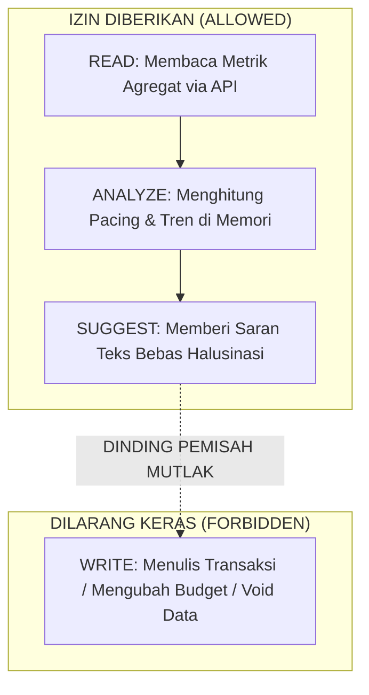

# AIRO Finance Lab — Intelligence Boundary Specification (v1.0)

- **Project**: `AIRO_FINANCE_LAB`
- **Document ID**: `AIRO_FINANCE_INTELLIGENCE_BOUNDARY_V1`
- **Status**: `LOCKED_ARCHITECTURE_DECISION`
- **Date**: `2026-09-11`
- **Task**: `AIRO_FINANCE_LAB_M5_INTELLIGENCE_BOUNDARY_DESIGN_V1`
- **Role**: `AIRO Executor Agent`
- **Mode**: `DESIGN_ONLY`

---

## 1. Executive Summary & Objective

Tujuan dari dokumen ini adalah mengunci batas kewenangan kecerdasan buatan (*Intelligence Layer*) dalam ekosistem AIRO Finance Lab sebelum kode atau prompt AI diimplementasikan. 

Prinsip fundamental:
> **"Finance Core adalah satu-satunya otoritas kebenaran data finansial. AI adalah lapisan penalaran dan penasihat murni (Read-Only Reasoning & Advisory Layer), BUKAN pelaksana mutasi buku besar."**

Arsitektur ini secara sadar dirancang untuk memutus pola kegagalan historis EAB (*Earesmes-Arfin Bridge*), di mana keterlibatan AI yang terlalu dalam pada jalur penulisan transaksi (*AI-Ledger Entanglement*) menyebabkan siklus interogasi berbelit-belit (*prompt loops*) dan risiko halusinasi data buku besar.

---

## 2. Authority Separation Matrix

Pemisahan kewenangan antara Finance Core dan AI Reasoning Layer ditetapkan secara absolut dan tidak dapat ditawar:

| Dimensi Operasional | Finance Core Engine (Python/SQL) | AI Reasoning Layer (Hermes / LLM) | Status Kebijakan |
|---|---|---|---|
| **Penyimpanan Saldo & Mutasi** | Otoritas Tunggal (ACID Transactions) | Zero Storage (Stateless Context) | **TERKUNCI** |
| **Kalkulasi Angka & Saldo** | Matematis Deterministik (Python math / SQL) | Dilarang berhitung mandiri tanpa data API | **TERKUNCI** |
| **Hak Tulis Database (INSERT/UPDATE/DELETE)** | Akses Penuh (Tervalidasi) | **DILARANG MUTLAK (ZERO WRITES)** | **TERKUNCI** |
| **Pencatatan Transaksi Baru** | Menerima dari Telegram/Dashboard Modal | Dilarang memicu mutasi tanpa intervensi user | **TERKUNCI** |
| **Penjelasan Bahasa Alami** | Format teks terstruktur sederhana | Penyusun narasi insight & konsultasi santai | **TERKUNCI** |
| **Deteksi Anomali & Pacing** | Penyedia metrik agregat | Menganalisis pola & memberi saran proaktif | **TERKUNCI** |

---

## 3. Data Access Boundary (READ, ANALYZE, SUGGEST, WRITE)

Akses AI terhadap data finansial diklasifikasikan ke dalam 4 tingkatan izin:



### 3.1 READ: **ALLOWED (Terkontrol via Tool Agregat)**
- AI diizinkan membaca data agregat yang telah divalidasi oleh Finance Core melalui endpoint khusus (misal: `GET /api/v1/hermes/finance-summary`).
- Data yang diberikan berupa angka pasti: total saldo per akun, total pengeluaran per kategori bulan ini, dan batas budget aktif.
- AI tidak diizinkan menjalankan raw SQL query bebas ke database.

### 3.2 ANALYZE: **ALLOWED (In-Memory Processing)**
- AI diizinkan melakukan komparasi kontekstual di memori kerja (in-context), misalnya: membandingkan laju pengeluaran tanggal 10 terhadap alokasi bulan berjalan (*budget burn-rate pacing*).
- AI diizinkan mengidentifikasi anomali belanja (misal: kategori Makanan naik 40% dibanding rata-rata minggu lalu).

### 3.3 SUGGEST: **ALLOWED (Advisory Text Only)**
- AI diizinkan menghasilkan narasi rekomendasi yang santai, jernih, dan tidak menggurui kepada Owner.
- Contoh: *"Egit, budget makan bulan ini sudah terpakai 82% padahal baru tanggal 11. Pacing harian yang aman sekitar Rp45.000/hari."*
- Rekomendasi bersifat pasif dan informatif.

### 3.4 WRITE: **STRICTLY FORBIDDEN (ZERO WRITES RULE)**
- **AI DILARANG MEMILIKI HAK TULIS KE DATABASE.**
- AI tidak boleh:
  1. Membuat transaksi secara otonom tanpa konfirmasi kartu 1-klik dari Owner.
  2. Mengubah plafon anggaran (*budget limit*).
  3. Membatalkan (*void*) transaksi masa lalu.
  4. Menghapus rekening atau kategori.
- Pelanggaran terhadap Zero Writes Rule dikategorikan sebagai cacat arsitektur fatal (*critical architectural defect*).

---

## 4. Intelligence Use Cases Tiering

Semua skenario kecerdasan dikelompokkan ke dalam 3 tier risiko:

```text
+-----------------------------------------------------------------------+
| TIER 1: SAFE READ-ONLY INSIGHTS (IN-SCOPE FOR PHASE 5)                |
| - Ringkasan pengeluaran bulanan / mingguan                            |
| - Tren per kategori dan saldo likuid real-time                        |
| - Deteksi anomali pola transaksi                                      |
+-----------------------------------------------------------------------+
                                  │
                                  ▼
+-----------------------------------------------------------------------+
| TIER 2: ADVISORY RECOMMENDATIONS (IN-SCOPE FOR PHASE 5)               |
| - Pacing alerts ("Budget makan hampir habis")                         |
| - Saran alokasi penghematan harian                                    |
| - Peringatan tagihan rutin yang mendekati jatuh tempo                 |
+-----------------------------------------------------------------------+
                                  │
                                  ▼
+-----------------------------------------------------------------------+
| TIER 3: AUTONOMOUS ACTIONS & MUTATIONS (STRICTLY DISALLOWED)          |
| - Eksekusi transaksi otomatis tanpa kartu konfirmasi                  |
| - Auto-rebalancing saldo rekening                                     |
| - Perubahan struktur anggaran otomatis                                |
+-----------------------------------------------------------------------+
```

### Keputusan Tier 3:
> **TIER 3 DITOLAK DAN DIKUNCI DI LUAR LINGKUP (DISALLOWED).**
> Jika suatu saat dibutuhkan aksi yang disarankan AI (misal: penyesuaian budget), alur yang diwajibkan adalah:
> $\text{AI Suggestion} \longrightarrow \text{Interactive Confirmation Card (Owner 1-Click)} \longrightarrow \text{Finance Core API}$.
> AI tidak pernah menjadi eksekutor langsung.

---

## 5. Anti-Hallucination & Numerical Grounding Protocol

Untuk mencegah model bahasa berhalusinasi perihal saldo dan angka rupiah:

1. **Strict Invariant Sourcing**:
   Semua angka moneter dalam jawaban AI wajib memiliki rujukan 1:1 dari payload JSON tool `finance-summary`. AI dilarang menebak saldo yang tidak ada di payload.
2. **Deterministic Pre-Calculated Context**:
   Kalkulasi sensitif (selisih budget, persentase pacing) dihitung secara deterministik oleh Python sebelum dikirimkan ke context prompt AI. AI bertugas membungkus angka valid tersebut ke dalam bahasa alami yang manusiawi.
3. **Format Representasi IDR Standar**:
   AI wajib menggunakan format standar rupiah Indonesia (`Rp35.000,00` atau `Rp1.500.000,00`) yang identik dengan output Finance Core.

---

## 6. Anti-EAB Check & Guardrails

### 6.1 Failure Modes (Bagaimana desain ini bisa berubah menjadi EAB?)
1. **Chatbot Interrogation Trap**: Bot mulai bertanya klarifikasi beruntun (*"Apakah ini makan siang atau malam? Mau pakai rekening apa? Pilih 1-4"*).
2. **Autonomous Mutation Desync**: AI memotong saldo buku besar berdasarkan asumsi obrolan yang belum tentu dimaksudkan sebagai transaksi riil oleh Owner.
3. **Complex Cross-Bot IPC**: Membangun antrean pesan lintas bot rumit dengan validasi tanda tangan HMAC berlebihan.

### 6.2 Preventative Guardrails (Pencegahan Mutlak)
1. **Single-Turn Input + Sane Defaults**: Input transaksi harian tetap diproses oleh regex parser M3 dengan konfirmasi 1-klik, bukan oleh LLM dialog state machine.
2. **Read-Only Sandbox**: Kredensial database atau token API yang dipegang oleh modul Hermes hanya memiliki hak akses `SELECT` (Read-Only). Secara teknis mustahil bagi AI untuk merusak data buku besar.
3. **Stateless Tool Calls**: Hermes memanggil Finance Core seperti memanggil API pihak ketiga standar (Request $\rightarrow$ Response JSON). Nol state interogasi yang menggantung.

### 6.3 Stop Rules (Kapan dilarang menambah AI?)
AI **DILARANG DITAMBAHKAN** atau diperluas jika salah satu kondisi berikut terjadi:
1. Pertanyaan Owner dapat dijawab lebih cepat (<100ms) oleh kartu widget di Web Dashboard.
2. Owner belum aktif menggunakan pencatatan harian selama 7 hari berturut-turut (*value manual belum terbukti*).
3. Latensi pemanggilan LLM melebihi 3 detik untuk query sederhana saldo.
4. Terdapat insiden halusinasi nominal uang (>0 toleransi pada angka finansial).
