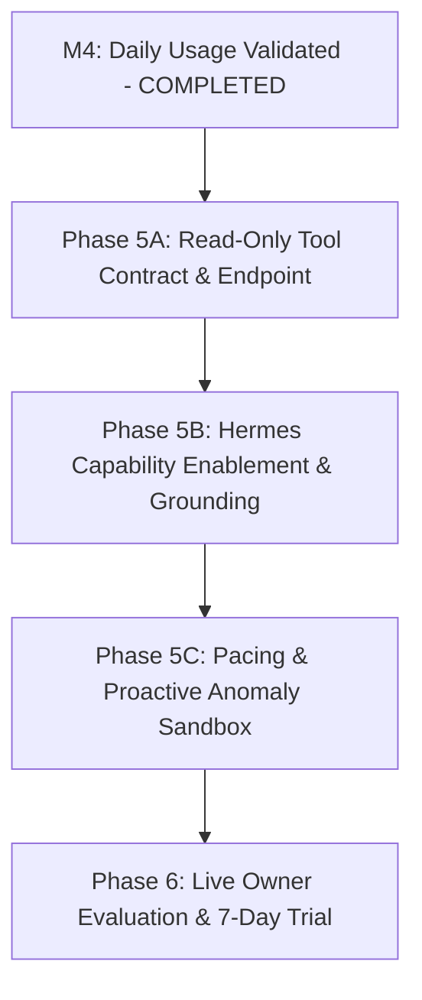

# AIRO Finance Lab — Intelligence Roadmap (v1.0)

- **Project**: `AIRO_FINANCE_LAB`
- **Document ID**: `AIRO_FINANCE_INTELLIGENCE_ROADMAP_V1`
- **Status**: `LOCKED_ARCHITECTURE_DECISION`
- **Date**: `2026-09-11`
- **Task**: `AIRO_FINANCE_LAB_M5_INTELLIGENCE_BOUNDARY_DESIGN_V1`
- **Role**: `AIRO Executor Agent`
- **Mode**: `DESIGN_ONLY`

---

## 1. Executive Summary & Phasing Strategy

Implementasi kecerdasan buatan (*Intelligence Layer*) dalam AIRO Finance Lab harus mengikuti metodologi bertahap yang terkendali ketat (*Controlled Phased Rollout*). Setiap fase memiliki pintu gerbang verifikasi (*verification gate*) yang wajib dipenuhi sebelum melanjutkan ke fase berikutnya.

Tujuan utama peta jalan ini adalah memastikan bahwa penambahan kapabilitas AI tidak pernah merusak stabilitas pencatatan harian yang telah terbukti pada M1–M4.

---

## 2. Phased Rollout Plan

### 2.1 Phase 5A: Read-Only Tool Contract & Endpoint Implementation
- **Fokus**: Membangun lapisan pembaca data agregat yang aman pada `airo_finance_core`.
- **Target Deliverable**:
  1. Method `FinanceCoreEngine.get_finance_summary(period_month, period_year)`: Menghitung total alokasi budget, pengeluaran riil per kategori, dan sisa saldo.
  2. Endpoint REST `GET /api/v1/hermes/finance-summary` dan `GET /api/v1/hermes/balances`.
  3. Strict read-only database query execution (memastikan query hanya `SELECT`).
- **Pintu Gerbang Kelulusan (Gate 5A)**:
  - Unit test membuktikan endpoint mengembalikan JSON payload tervalidasi dalam waktu $<50\text{ ms}$.
  - Zero mutation test: Menjamin fungsi pembaca tidak menghasilkan entri baru di tabel `audit_logs` atau mengubah nilai saldo.

### 2.2 Phase 5B: Hermes Capability Enablement & Grounding
- **Fokus**: Menghubungkan tool read-only Phase 5A ke AIRO Hermes.
- **Target Deliverable**:
  1. Spesifikasi Tool Definition Hermes: `get_finance_summary(category, month)`.
  2. Hermes System Prompt Guard: Penegasan batasan bahwa Hermes hanya membaca, dilarang berhalusinasi angka di luar payload JSON, dan menjawab dengan gaya akrab, ringkas, dan presisi.
  3. Grounding Verification Suite: Test otomatis skenario tanya jawab (misal: "Berapa sisa uang di BCA?", "Budget makan sisa berapa?") dengan validasi kecocokan angka 100% terhadap database.
- **Pintu Gerbang Kelulusan (Gate 5B)**:
  - Numerical Grounding Score: **100%** (Nol kesalahan kutipan angka moneter).
  - Latensi respons total: $<2.5\text{ detik}$.

### 2.3 Phase 5C: Pacing & Proactive Anomaly Sandbox
- **Fokus**: Logika analitik komparatif untuk deteksi laju pengeluaran dan anomali.
- **Target Deliverable**:
  1. Modul algoritma analitik Python deterministik:
     - `calculate_daily_burn_rate()`: Menghitung laju konsumsi anggaran harian vs hari tersisa.
     - `detect_spending_anomalies()`: Mendeteksi pengeluaran di atas 2 standar deviasi harian.
  2. Format peringatan proaktif (Tier 2 Advisory) yang santai dan tidak spammy.
- **Pintu Gerbang Kelulusan (Gate 5C)**:
  - Anomaly detection test cases lulus 100% pada dataset pengujian.
  - Zero autonomous actions: Peringatan hanya berupa teks saran; tidak ada mutasi buku besar otomatis.

---

## 3. Explicit Developer & Agent Boundary Checklist

Siapapun developer atau AI agent yang mengimplementasikan fase berikutnya **WAJIB MEMATUHI CHECKLIST INI**:

| Item Pemeriksaan | Batasan yang Berlaku | Status Kepatuhan |
|---|---|---|
| **Akses Database AI** | Hanya `SELECT`, tidak boleh ada hak `INSERT`/`UPDATE`/`DELETE` | **MANDATORY** |
| **Pencatatan Transaksi** | Wajib lewat Telegram Quick Capture M3 / Web Modal, bukan dari chat LLM bebas | **MANDATORY** |
| **Kredensial API Key** | Kredensial AI tidak boleh disimpan di kode atau repo (wajib via runtime env) | **MANDATORY** |
| **Token Telegram** | Dilarang membuat bot Telegram terpisah yang melakukan `getUpdates` tandingan | **MANDATORY** |
| **Format Angka** | Wajib menggunakan representasi standar `Rp...` tanpa pembulatan liar | **MANDATORY** |
| **Status Interogasi** | Dilarang membuat dialog kuis interogasi berulang (*anti-EAB state trap*) | **MANDATORY** |
| **Arsitektur Worker** | Tidak boleh menambahkan background cron worker tanpa persetujuan eksplisit Owner | **MANDATORY** |

---

## 4. Acceptance Metrics & Non-Negotiable Constraints

Fase kecerdasan (Intelligence Layer) hanya dianggap berhasil jika memenuhi metrik berikut:

1. **Zero Financial Hallucination**: Toleransi halusinasi angka adalah **0%**. Jika angka tidak tercantum di database, AI wajib menyatakan tidak tahu.
2. **Deterministic Computation**: Seluruh operasi aritmatika (+, -, %) dihitung oleh Python engine sebelum disajikan ke LLM. LLM hanya bertugas memparafrasekan teks.
3. **Response Speed**: Latensi pemanggilan tool dan respons Hermes di bawah 3 detik.
4. **Preservation of M1–M4**: Seluruh 17 automated tests M1–M3 dan script validasi M4 wajib terus berstatus **100% PASS (Zero Regression)**.
