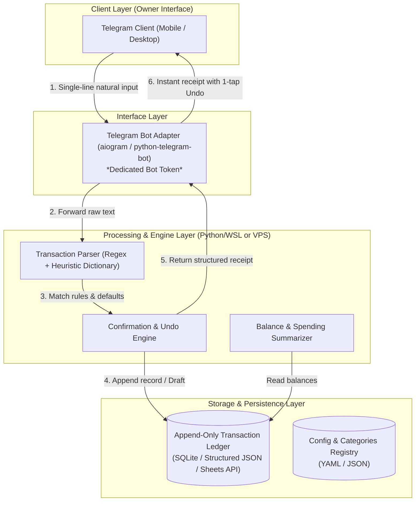

# AIRO Finance Lab — Architecture Decision Record (ADR) v1.0

- **Project**: `AIRO_FINANCE_LAB`
- **Document Version**: `1.0.0`
- **Status**: `DRAFT_DESIGN_ONLY`
- **Date**: `2026-09-11`
- **Authority**: Architecture Design Phase (`MODE=DESIGN_ONLY`, `MUTATION=NO`)
- **Key Focus**: Decoupled Layers, Deterministic Runtime, Stateless Pipeline, Telegram Isolation

---

## 1. Context & Architectural Root-Cause Analysis

### 1.1 Legacy Architecture Pitfalls (Why Legacy Arfin & EAB Stalled)
1. **The Monolithic Google Apps Script Container**:
   - In Legacy Arfin, the webhook intake, Telegram formatting, natural language heuristics, spreadsheet cell manipulation, and trigger schedulers all lived in one 15,000+ line JavaScript file (`AIRO_Finance_Multitab_Final_v1.js`).
   - In EAB, changes pushed via `clasp` were masked by Google's opaque edge-container execution caching (observed in P8 defect `AFPD-INC-012`), making deployments non-deterministic and debugging excruciating.
2. **Entangled State Machines (State Traps)**:
   - When users tried to answer multi-turn prompts, an unexpected input or delayed webhook created orphaned pending records. The bot repeatedly asked for `"nomor + pilihan kategori"` without an escape hatch.
3. **Premature Cross-System Bridges**:
   - EAB attempted an HMAC-SHA256 authenticated HTTP bridge between Hermes (Python/WSL) and Apps Script before either side had a robust, standalone natural transaction parsing engine.
4. **Identity & Routing Confusion**:
   - Cross-project polling and webhook collisions between Earesmes, Arfin, and EarnsAI caused messages meant for one agent to trigger transaction drafts in another.

---

## 2. Architecture Decisions



### ADR-01: Decoupling Storage, Business Logic, and Interface
- **Decision**: AIRO Finance Lab separates all responsibilities into three distinct, decoupled layers:
  1. **Interface Layer**: Dedicated Telegram Bot service handling only messaging, keyboards, and rate-limiting.
  2. **Processing Layer (Engine)**: Stateless Python engine that receives raw text, parses amounts/categories/wallets, applies defaults, and formats receipts.
  3. **Storage Layer (Ledger)**: Independent append-only data store.
- **Rationale**: Any layer can be refactored, tested, or swapped without breaking the others. Testing the parser requires zero network calls or Telegram interaction.

### ADR-02: Stateless Processing Pipeline vs Multi-Turn State Machines
- **Decision**: Avoid rigid multi-turn state machines. Adopt an **Atomic Parse-and-Confirm** model:
  - Input: `makan 35k bca` $\rightarrow$ Evaluated in one shot.
  - If some parameters are missing (e.g. `makan 35k`), the engine applies **Sane Defaults** (e.g. default wallet `Cash`, category `Makanan & Minuman`) and generates a receipt clearly highlighting the assumed fields.
  - The receipt includes inline buttons: `[Batal / Undo]` and `[Ganti Rekening]`.
  - The user is never trapped waiting for an answer to move on with their day.
- **Rationale**: Eliminates orphaned pending state, state persistence bugs across restarts, and container caching locks.

### ADR-03: Runtime Platform — Pure Python (WSL2/VPS) over Google Apps Script
- **Decision**: The execution brain of AIRO Finance Lab will reside in **Python 3 on Linux (WSL2 / VPS)**, NOT in Google Apps Script.
  - If Google Sheets is used for Owner visibility, it will be treated strictly as an external data sink via Google Sheets API / Service Account.
  - Zero application logic, parsing, or Telegram handling will run inside Apps Script.
- **Rationale**:
  - Eliminates Google edge container script caching latency and version discrepancies.
  - Deterministic CI/CD, local testing via `pytest`, immediate reload, and full git traceability.
  - Fast response times ($<1$ second compared to Apps Script's 2–5 second cold-starts).

### ADR-04: Storage Model — Append-Only Ledger with Soft Invalidation
- **Decision**: The primary transaction database is strictly **Append-Only**.
  - A transaction row schema:
    ```json
    {
      "tx_id": "TX-20260911-0001",
      "timestamp": "2026-09-11T21:00:00+07:00",
      "raw_text": "makan siang 35k bca",
      "direction": "EXPENSE",
      "amount": 35000,
      "currency": "IDR",
      "account": "BCA",
      "category": "MAKANAN_MINUMAN",
      "status": "CONFIRMED", // CONFIRMED | VOIDED
      "void_reason": null,
      "source_channel": "TELEGRAM"
    }
    ```
  - When the Owner clicks `[Undo]`, the system does NOT delete rows or shift indices; it appends a `VOID` event or marks `status="VOIDED"`.
- **Rationale**: Safe, audit-proof, impossible to corrupt balances or spreadsheet formula ranges.

### ADR-05: Telegram Identity & Webhook Boundary
- **Decision**: Adhere strictly to [`systems/telegram-agent-identity-contract.md`](file:///c:/Users/Admin/.gemini/antigravity/scratch/airo-second-brain/systems/telegram-agent-identity-contract.md).
  - AIRO Finance Lab must utilize its own distinct Telegram Bot token.
  - Dunder/getUpdates ownership is strictly locked to this bot runner.
  - No message sharing, no token re-use, and no cross-talk with Earesmes or EarnsAI.

---

## 3. Technology Stack & Component Selection

| Component | Choice | Rationale | Alternatives Rejected |
|---|---|---|---|
| **Language & Runtime** | Python 3.11+ (WSL2 / Linux VPS) | Fast, rich regex/parsing libraries, robust unit testing, instant restarts. | Google Apps Script (caching issues), Node.js (adds runtime sprawl). |
| **Bot Framework** | `python-telegram-bot` or `aiogram` | Modern, asynchronous, supports inline keyboards and graceful error handling. | Apps Script Webhook (cold starts, edge caching). |
| **Parsing Engine** | Deterministic Pattern Matcher + Heuristic Dictionary | 100% predictable, zero token cost, sub-millisecond execution, transparent regex rules. | LLM-only parser (slow, costly, non-deterministic for numbers). |
| **Local Storage** | SQLite / Local Append-Only JSON | Zero setup, ACID compliant, easily backed up, portable. | Direct Sheets writes on every keystroke (rate limits, latency). |
| **External Mirror (Optional)** | Google Sheets API (via background batch sync) | Accessible to Owner on mobile, familiar spreadsheet UI. | Direct synchronous sheet cell manipulation inside message handler. |

---

## 4. Verification & Testing Strategy

1. **Deterministic Unit Tests**:
   - Comprehensive test suite for the parser covering Indonesian number formats (`35k`, `35rb`, `35.000`, `35000`), common merchant keywords, and direction classification.
2. **Stateless Recovery Test**:
   - Process kill and restart during mid-session must leave zero corrupted state.
3. **Latency Benchmarking**:
   - From webhook ingress to receipt dispatch: target $\le 1.5$ seconds.
