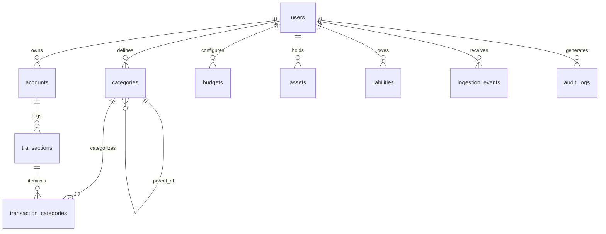
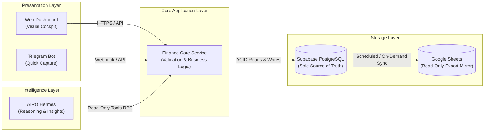

# AIRO Finance Lab — Database Schema Decision Record (v1.0)

- **Project**: `AIRO_FINANCE_LAB`
- **Document ID**: `AIRO_FINANCE_LAB_DATABASE_SCHEMA_DECISION_V1`
- **Status**: `APPROVED_CANONICAL_DECISION`
- **Date**: `2026-09-11`
- **Authority**: Owner-Directed (`TASK=AIRO_FINANCE_LAB_DATABASE_SCHEMA_AND_IMPLEMENTATION_PLAN_V1`)
- **Product Vision**: Personal Finance Intelligence Application (Dashboard-first + Telegram quick capture + Hermes intelligence layer)

---

## 1. Section A: Database Decision & Architecture Trade-offs

### 1.1 Comparative Analysis

| Dimension | Spreadsheet as Primary Database (Legacy AIRO Finance) | Supabase PostgreSQL as Primary Storage (AIRO Finance Lab) |
|---|---|---|
| **Data Integrity & Constraints** | ❌ **Weak**: No foreign keys, no check constraints, data types easily corrupted by manual cell edits or copy-paste errors. | ✅ **Strict**: Full ACID compliance, foreign keys, enum checks, NOT NULL constraints, unique indexes, and row-level validation. |
| **Concurrency & Latency** | ❌ **Slow & Fragile**: Google Sheets API calls take 1.5–3.5s per roundtrip. Rate limits (60 requests/minute/user). Simultaneous writes cause cell overwrites. | ✅ **Sub-50ms Performance**: Instant indexing, connection pooling, high throughput, and native optimistic locking. |
| **API & Developer Experience** | ❌ **Opaque & Cumbersome**: Monolithic Google Apps Script, opaque container caching (`AFPD-INC-012`), complex Range coordinates (`A1:K41`). | ✅ **Modern & Decoupled**: Instant REST and GraphQL APIs, auto-generated type definitions, native Python & TypeScript client libraries. |
| **State & Event Streaming** | ❌ **Non-existent**: Requires polling or fragile Google Sheet `onEdit` triggers which fail silently under batch mutations. | ✅ **Native Realtime**: Built-in change data capture (CDC) and WebSocket subscriptions for instant dashboard sync. |
| **Presentation vs Storage** | ❌ **Tightly Coupled**: Storage layout is bound to visual presentation. Adding a summary panel shifts cell references and breaks scripts. | ✅ **Clean Separation**: Data resides in optimized relational tables. Presentation layers (Web, Telegram, Hermes) query decoupled views/endpoints. |
| **Operational Maintenance** | ❌ **High Cognitive Burden**: Constant dread of broken formula references, script version caching mismatches, and messy multi-tab maintenance. | ✅ **Zero Routine Maintenance**: Managed database, automated daily backups, standard database migration scripts (`db/migrations`). |

### 1.2 Final Decision & Rationale

**DECISION**: **Supabase PostgreSQL is selected as the Primary Storage & Source of Truth for AIRO Finance Lab.**

**RATIONALE**:
1. **Root Cause Eradication**: The single greatest cause of failure in Legacy Arfin and EAB was treating Google Sheets as a transactional database and Apps Script as an application server. Moving to Supabase permanently eliminates edge script caching bugs, API quota throttling, and cell reference fragility.
2. **Dashboard-First Reality**: A responsive personal finance dashboard requires fast filtering, aggregations (monthly grouping, category breakdowns), and instant updates that are technically impractical on Google Sheets.
3. **Demotion of Spreadsheet to Visual Sink**: Google Sheets is NOT eliminated from the Owner's life; rather, it is demoted to an **Export / Reporting Mirror**. Clean, batch exports or scheduled CSV dumps can push verified summaries to Google Drive/Sheets for passive viewing without risking transactional data integrity.

---

## 2. Section B: Core Relational Entities Specification

AIRO Finance Lab enforces an ultra-clean, normalized PostgreSQL schema designed for personal finance clarity without enterprise bloat.

### 2.1 Entity Relationship Diagram (Mermaid)



### 2.2 Schema Definitions (PostgreSQL DDL)

#### 1. `users` (Owner Profile)
```sql
CREATE TABLE users (
    id UUID PRIMARY KEY DEFAULT gen_random_uuid(),
    username TEXT NOT NULL UNIQUE,
    full_name TEXT NOT NULL,
    base_currency VARCHAR(3) NOT NULL DEFAULT 'IDR',
    created_at TIMESTAMPTZ NOT NULL DEFAULT NOW(),
    updated_at TIMESTAMPTZ NOT NULL DEFAULT NOW()
);
```

#### 2. `accounts` (Financial Wallets & Institutions)
```sql
CREATE TYPE account_type AS ENUM ('CASH', 'BANK', 'E_WALLET', 'CREDIT_CARD', 'INVESTMENT');

CREATE TABLE accounts (
    id UUID PRIMARY KEY DEFAULT gen_random_uuid(),
    user_id UUID NOT NULL REFERENCES users(id) ON DELETE CASCADE,
    name TEXT NOT NULL, -- e.g. 'BCA Utama', 'Blu BCA', 'Cash Dompet'
    account_type account_type NOT NULL,
    institution TEXT, -- 'BCA', 'Mandiri', 'Gojek'
    currency VARCHAR(3) NOT NULL DEFAULT 'IDR',
    current_balance NUMERIC(15, 2) NOT NULL DEFAULT 0.00,
    is_active BOOLEAN NOT NULL DEFAULT TRUE,
    created_at TIMESTAMPTZ NOT NULL DEFAULT NOW(),
    updated_at TIMESTAMPTZ NOT NULL DEFAULT NOW()
);
```

#### 3. `categories` (Hierarchical Categorization)
```sql
CREATE TYPE transaction_direction AS ENUM ('EXPENSE', 'INCOME', 'TRANSFER');

CREATE TABLE categories (
    id UUID PRIMARY KEY DEFAULT gen_random_uuid(),
    user_id UUID NOT NULL REFERENCES users(id) ON DELETE CASCADE,
    parent_id UUID REFERENCES categories(id) ON DELETE SET NULL,
    name TEXT NOT NULL, -- e.g. 'Makanan & Minuman', 'Kopi', 'Transportasi'
    direction transaction_direction NOT NULL DEFAULT 'EXPENSE',
    icon TEXT, -- Lucide icon name or emoji
    is_active BOOLEAN NOT NULL DEFAULT TRUE,
    created_at TIMESTAMPTZ NOT NULL DEFAULT NOW()
);
```

#### 4. `transactions` (Authoritative Transaction Ledger)
```sql
CREATE TYPE transaction_status AS ENUM ('CONFIRMED', 'VOIDED', 'PENDING_REVIEW');

CREATE TABLE transactions (
    id UUID PRIMARY KEY DEFAULT gen_random_uuid(),
    user_id UUID NOT NULL REFERENCES users(id) ON DELETE CASCADE,
    account_id UUID NOT NULL REFERENCES accounts(id) ON DELETE RESTRICT,
    destination_account_id UUID REFERENCES accounts(id) ON DELETE RESTRICT, -- Only populated for internal TRANSFER
    amount NUMERIC(15, 2) NOT NULL CHECK (amount > 0),
    direction transaction_direction NOT NULL,
    status transaction_status NOT NULL DEFAULT 'CONFIRMED',
    transaction_date DATE NOT NULL DEFAULT CURRENT_DATE,
    raw_text TEXT, -- Captured user message e.g. 'makan siang 35k bca'
    note TEXT,
    source_channel VARCHAR(32) NOT NULL DEFAULT 'TELEGRAM', -- 'TELEGRAM', 'DASHBOARD', 'HERMES'
    void_reason TEXT,
    created_at TIMESTAMPTZ NOT NULL DEFAULT NOW(),
    updated_at TIMESTAMPTZ NOT NULL DEFAULT NOW()
);
```

#### 5. `transaction_categories` (Itemization & Category Linking)
```sql
CREATE TABLE transaction_categories (
    id UUID PRIMARY KEY DEFAULT gen_random_uuid(),
    transaction_id UUID NOT NULL REFERENCES transactions(id) ON DELETE CASCADE,
    category_id UUID NOT NULL REFERENCES categories(id) ON DELETE RESTRICT,
    allocated_amount NUMERIC(15, 2) NOT NULL CHECK (allocated_amount > 0),
    created_at TIMESTAMPTZ NOT NULL DEFAULT NOW()
);
```

#### 6. `budgets` (Monthly Planning & Envelope Pacing)
```sql
CREATE TABLE budgets (
    id UUID PRIMARY KEY DEFAULT gen_random_uuid(),
    user_id UUID NOT NULL REFERENCES users(id) ON DELETE CASCADE,
    category_id UUID NOT NULL REFERENCES categories(id) ON DELETE CASCADE,
    period_year INT NOT NULL,
    period_month INT NOT NULL CHECK (period_month BETWEEN 1 AND 12),
    allocated_amount NUMERIC(15, 2) NOT NULL CHECK (allocated_amount >= 0),
    created_at TIMESTAMPTZ NOT NULL DEFAULT NOW(),
    updated_at TIMESTAMPTZ NOT NULL DEFAULT NOW(),
    UNIQUE(user_id, category_id, period_year, period_month)
);
```

#### 7. `assets` (Non-Liquid Personal Wealth)
```sql
CREATE TYPE asset_type AS ENUM ('GOLD', 'PROPERTY', 'VEHICLE', 'OTHER');

CREATE TABLE assets (
    id UUID PRIMARY KEY DEFAULT gen_random_uuid(),
    user_id UUID NOT NULL REFERENCES users(id) ON DELETE CASCADE,
    name TEXT NOT NULL, -- e.g. 'Emas Antam 10g', 'Rumah Tinggal'
    asset_type asset_type NOT NULL,
    acquisition_date DATE,
    acquisition_value NUMERIC(15, 2) NOT NULL DEFAULT 0.00,
    current_valuation NUMERIC(15, 2) NOT NULL DEFAULT 0.00,
    valuation_updated_at TIMESTAMPTZ NOT NULL DEFAULT NOW(),
    note TEXT,
    created_at TIMESTAMPTZ NOT NULL DEFAULT NOW()
);
```

#### 8. `liabilities` (Debts & Long-term Installments)
```sql
CREATE TYPE liability_type AS ENUM ('MORTGAGE', 'PERSONAL_LOAN', 'CREDIT_CARD_INSTALLMENT', 'OTHER');

CREATE TABLE liabilities (
    id UUID PRIMARY KEY DEFAULT gen_random_uuid(),
    user_id UUID NOT NULL REFERENCES users(id) ON DELETE CASCADE,
    name TEXT NOT NULL, -- e.g. 'KPR Rumah', 'Cicilan Gadget'
    liability_type liability_type NOT NULL,
    lender TEXT NOT NULL,
    principal_amount NUMERIC(15, 2) NOT NULL,
    remaining_balance NUMERIC(15, 2) NOT NULL,
    monthly_payment NUMERIC(15, 2) NOT NULL,
    due_day INT CHECK (due_day BETWEEN 1 AND 31),
    total_tenor_months INT,
    paid_tenor_months INT DEFAULT 0,
    is_active BOOLEAN NOT NULL DEFAULT TRUE,
    note TEXT,
    created_at TIMESTAMPTZ NOT NULL DEFAULT NOW(),
    updated_at TIMESTAMPTZ NOT NULL DEFAULT NOW()
);
```

#### 9. `audit_logs` (System Security & Invariant Verification)
```sql
CREATE TABLE audit_logs (
    id UUID PRIMARY KEY DEFAULT gen_random_uuid(),
    user_id UUID REFERENCES users(id) ON DELETE SET NULL,
    entity_name VARCHAR(64) NOT NULL,
    entity_id UUID NOT NULL,
    action VARCHAR(16) NOT NULL, -- 'INSERT', 'UPDATE', 'VOID', 'DELETE'
    actor VARCHAR(64) NOT NULL, -- 'TELEGRAM_BOT', 'WEB_DASHBOARD', 'HERMES_AGENT', 'SYSTEM'
    before_state JSONB,
    after_state JSONB,
    ip_address INET,
    created_at TIMESTAMPTZ NOT NULL DEFAULT NOW()
);
```

#### 10. `ingestion_events` (Stateless Intake Staging Queue)
```sql
CREATE TYPE ingestion_status AS ENUM ('RECEIVED', 'PARSED', 'COMMITTED', 'REJECTED');

CREATE TABLE ingestion_events (
    id UUID PRIMARY KEY DEFAULT gen_random_uuid(),
    user_id UUID REFERENCES users(id) ON DELETE CASCADE,
    source_channel VARCHAR(32) NOT NULL, -- 'TELEGRAM', 'EMAIL', 'MANUAL_IMPORT'
    raw_payload TEXT NOT NULL,
    parsed_payload JSONB,
    status ingestion_status NOT NULL DEFAULT 'RECEIVED',
    error_message TEXT,
    processed_at TIMESTAMPTZ,
    created_at TIMESTAMPTZ NOT NULL DEFAULT NOW()
);
```

---

## 3. Section C: Migration Mapping from Legacy Spreadsheet

The following deterministic mapping bridges historical Google Sheets assets to the new Supabase relational schema:

| Legacy Google Sheets Source | Target Supabase Entity | Field-by-Field Mapping & Transformation Rules |
|---|---|---|
| **`📒 Account Ledger`** | `transactions` + `transaction_categories` | - `Date` $\rightarrow$ `transactions.transaction_date`<br/>- `Account` $\rightarrow$ `accounts.id` (via name lookup)<br/>- `Direction` $\rightarrow$ `transactions.direction`<br/>- `Amount` $\rightarrow$ `transactions.amount` (normalized integer/numeric)<br/>- `Category` / `Subcategory` $\rightarrow$ `transaction_categories.category_id`<br/>- `Note` $\rightarrow$ `transactions.note`<br/>- Legacy row order preserved via monotonic timestamp assignment. |
| **`🧾 Review Queue`** | `ingestion_events` | - Pending items migrate to `ingestion_events` with `status='RECEIVED'`.<br/>- Unresolved multi-pending items are staged as JSON payloads in `parsed_payload` without blocking the main ledger. |
| **`Account Registry`** | `accounts` | - `Account Name` $\rightarrow$ `accounts.name`<br/>- `Account Type` $\rightarrow$ `accounts.account_type` (mapped to enum)<br/>- `Status` (`ACTIVE`/`INACTIVE`) $\rightarrow$ `accounts.is_active`<br/>- Opening balances initialized based on latest verified ledger balance. |
| **`Category Registry` & `Subcategory Registry`** | `categories` | - Category Name $\rightarrow$ `categories.name` (where `parent_id IS NULL`)<br/>- Subcategory Name $\rightarrow$ child row where `categories.parent_id` points to the primary Category.<br/>- Direction inferred from legacy mapping (`Pengeluaran` $\rightarrow$ `EXPENSE`). |
| **`🏠 Cicilan Rumah` & `🤝 Hutang`** | `liabilities` | - Placed into `liabilities` with `liability_type='MORTGAGE'` or `'PERSONAL_LOAN'`.<br/>- Tenor and monthly payments populated directly from sheet headers. |
| **`🥇 Aset`** | `assets` | - Gold and property holdings mapped into `assets` with `asset_type='GOLD'` or `'PROPERTY'`. |

---

## 4. Section D: Data Ownership & Component Boundaries

To permanently guard against the architecture entanglement that plagued EAB, strict boundary contracts are established across the four ecosystem layers:



### 1. Finance Core Service (Source of Truth)
- **Authority**: Sole owner of business logic, balance validation, and mutation execution.
- **Rule**: All mutations (whether originating from Telegram, the Web Dashboard, or batch imports) MUST pass through Finance Core verification. No component may execute raw arbitrary SQL writes directly.

### 2. AIRO Hermes (Intelligence & Reasoning Layer)
- **Authority**: High-level conversational assistant, financial advisory, and analysis.
- **Rule**: Hermes operates strictly in **Read-Only** mode via dedicated, safe tool endpoints (e.g. `get_monthly_spending()`, `get_account_balances()`, `query_budget_status()`).
- **Forbidden**: Hermes is strictly prohibited from mutating the database, issuing financial writes, or holding transactional state.

### 3. Dashboard (Presentation Layer)
- **Authority**: Rich visualization, transaction filtering, manual adjustments, and monthly analytics.
- **Rule**: Operates directly on Finance Core API. Provides instant visual feedback, responsive mobile layouts, and export triggers.

### 4. Spreadsheet (Export & Reporting Only)
- **Authority**: Secondary passive data mirror.
- **Rule**: Google Sheets has **Zero Transactional Authority**. It is populated asynchronously via background export for Owner comfort. A corrupted cell in Google Sheets has zero impact on core balances.

---

## 5. Section E: Anti-Overengineering Guardrails

AIRO Finance Lab is built specifically for a single personal owner (Egit). To keep code maintainable and failure-proof, the following patterns are explicitly outlawed:

1. **NO Multi-Tenancy**: The schema does not include complex workspace sharing, organization domains, or role-based team permissions. Single `user_id` context is standard.
2. **NO Enterprise Double-Entry Accounting Bloat**: Do not implement dual debits/credits across nominal/ledger journals. Real-world personal transactions are single-direction outflows/inflows between accounts with clear categories.
3. **NO High-Frequency Market Scraping Engine**: Do not build automated real-time cryptocurrency tickers, live stock websocket feeds, or dynamic investment portfolio rebalancers into the core database.
4. **NO Premature Microservices**: All core finance logic resides in a single, clean Python package (`airo-finance-core`). No distributed message buses, Kafka clusters, or distributed transaction coordinators.
