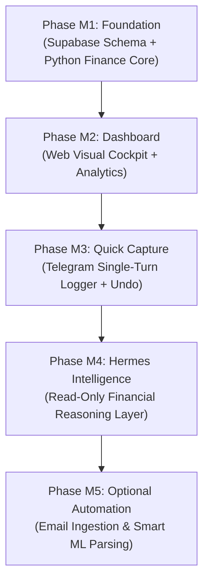

# AIRO Finance Lab — Phased Implementation Plan (v1.0)

- **Project**: `AIRO_FINANCE_LAB`
- **Document ID**: `AIRO_FINANCE_LAB_IMPLEMENTATION_PLAN_V1`
- **Status**: `APPROVED_ROADMAP_PLAN`
- **Date**: `2026-09-11`
- **Authority**: Owner-Directed (`TASK=AIRO_FINANCE_LAB_DATABASE_SCHEMA_AND_IMPLEMENTATION_PLAN_V1`)
- **Product Vision**: Personal Finance Intelligence Application (Dashboard-first + Telegram quick capture + Hermes intelligence layer)

---

## 1. Executive Phasing Strategy

To prevent repeating the architectural failures of EAB (over-ambitious scope, premature automation, rigid state machines, and entangled code), AIRO Finance Lab executes strictly through a **5-Phase Linear Milestone Progression**.

### Phase Progression Principles:
1. **No Leapfrogging**: Phase $N+1$ cannot start until Phase $N$ meets 100% of its Definition of Done (DoD) and has verified Owner acceptance.
2. **Value Before Automation**: Automation (email ingestion, scheduled triggers) is quarantined to the final phase (M5) and will only be tackled once daily manual and dashboard flows are stable.
3. **Single Retest Failure Rule**: During any phase, a defect gets exactly ONE repair cycle. If the second test fails, STOP and REPLAN.

---

## 2. Milestone Phasing Breakdown

### Phase M1: Foundation (Database Schema & Finance Core)

- **Objective**: Establish the rock-solid transactional foundation: Supabase PostgreSQL database schema, data access models, and deterministic transaction lifecycle.
- **Target Deliverables**:
  1. **Database Schema & Migrations**:
     - Supabase migration script (`db/migrations/001_initial_schema.sql`) implementing the 10 core entities (`users`, `accounts`, `categories`, `transactions`, `transaction_categories`, `budgets`, `assets`, `liabilities`, `audit_logs`, `ingestion_events`).
     - Row Level Security (RLS) policies enforcing single-owner access.
     - Database seed script (`db/seeds/initial_categories_and_accounts.sql`) importing standard accounts (BCA, Blu, Mandiri, Cash) and baseline Indonesian categories.
  2. **Python Finance Core SDK (`airo_finance_core`)**:
     - Clean, modular Python package in WSL2/Linux.
     - Relational models (Pydantic / SQLModel / SQLAlchemy).
     - Transaction Lifecycle Engine:
       - `create_transaction()` $\rightarrow$ atomic balance deduction/addition.
       - `void_transaction()` $\rightarrow$ soft-delete/invalidation with balance reversal.
       - `get_account_balances()` $\rightarrow$ cached/computed balance state.
       - `audit_logger()` $\rightarrow$ immutable audit event logging.
- **Definition of Done (DoD)**:
  - [ ] 100% of Supabase tables created with verified foreign keys and constraints.
  - [ ] Automated unit test suite (`pytest tests/test_core/`) passes 20 core transaction scenarios (income, expense, transfer, voiding).
  - [ ] Balance invariant test: sum of account changes equals net transaction sum.
  - [ ] Zero network coupling to Telegram or external AI.

---

### Phase M2: Dashboard (Dashboard-First Presentation Layer)

- **Objective**: Deliver the visual centerpiece of AIRO Finance Lab: a fast, elegant, responsive Web Cockpit replacing the legacy Google Sheets dashboard.
- **Target Deliverables**:
  1. **Overview & Financial Net Worth Cockpit**:
     - Real-time balance display across active accounts (Liquid Cash vs Bank vs E-Wallet).
     - Monthly spending summary vs budget pacing bar.
     - Key financial health cards (Assets vs Liabilities).
  2. **Transaction History & Ledger Explorer**:
     - Paginated, searchable, filterable transaction table.
     - Month and Year selector dropdowns.
     - Category and Account filter tags.
  3. **Interactive Manual Transaction Entry**:
     - Fast web modal to record manual transactions directly from laptop or mobile browser.
     - Instant balance reflection without page reload via Supabase realtime.
  4. **Basic Spending Analytics**:
     - Top-5 spending categories breakdown.
     - Visual bar comparing current month vs previous month spending.
- **Definition of Done (DoD)**:
  - [ ] Web dashboard boots locally and loads full financial state in $<800$ms.
  - [ ] Manual transaction entry updates account balance in real-time.
  - [ ] Tested on both desktop browser and mobile viewport (responsive UI).
  - [ ] Owner visually accepts cockpit layout (`OWNER_DASHBOARD_ACCEPTANCE=PASS`).

---

### Phase M3: Quick Capture (Telegram Capture & Natural Language Parser)

- **Objective**: Provide an ultra-frictionless mobile entry point for the Owner on-the-go, avoiding all EAB multi-turn prompt deadlocks.
- **Target Deliverables**:
  1. **Natural Language Parser Engine**:
     - Adapt and package `ecosystem/projects/vortex-ai-skill-lab/airo_personal_workflow/intents/parser.py`.
     - Deterministic regex for IDR amount parsing (`35k`, `50rb`, `1.5jt`, `1250000`).
     - Sane defaults: if wallet is unspecified, default to primary liquid wallet (`Cash` or `BCA Utama`).
  2. **Single-Turn Telegram Bot Service**:
     - Standalone Python bot running on WSL2 / VPS using dedicated Bot Token.
     - Flow: User sends `makan siang 35k bca` $\rightarrow$ Bot returns instant receipt card.
     - Interactive Inline Keyboards: `[🗑️ Batal / Undo]` and `[✏️ Ubah Rekening]`.
     - 1-Tap Undo window: Clicking Batal voids the transaction and reverses balance immediately.
  3. **Zero-State Deadlock Protection**:
     - Any unrecognized text or `/start` or `/batal` command cleanly resets state.
     - No multi-question quiz loops.
- **Definition of Done (DoD)**:
  - [ ] Telegram bot responds to transaction inputs in $<2$ seconds.
  - [ ] 20 natural language test cases (slang, shorthand, missing fields) parsed accurately.
  - [ ] 1-Tap Undo button successfully sets `status='VOIDED'` and restores balance.
  - [ ] **Mandatory 7-Day Live Owner Trial**: Owner records daily expenses for 7 consecutive days with zero state traps.

---

### Phase M4: Hermes Integration (Intelligence & Reasoning Layer)

- **Objective**: Equip AIRO Hermes with safe, read-only financial intelligence tools to answer complex financial questions naturally.
- **Target Deliverables**:
  1. **Finance Context Tools for Hermes**:
     - `get_finance_summary(month, year)`: Returns structured spending breakdown and budget utilization.
     - `get_account_balances()`: Returns latest balances per account.
     - `search_transactions(query, limit)`: Safe parameterized semantic search.
  2. **Reasoning & Advisory Prompts**:
     - Hermes can explain: *"Berapa sisa budget makan bulan ini?"* or *"Kenapa pengeluaran minggu lalu tinggi?"*
     - Natural conversational insights without touching raw database tables.
  3. **Strict Authority Isolation**:
     - Hermes has zero write endpoints. All tool handlers are read-only.
- **Definition of Done (DoD)**:
  - [ ] Hermes accurately answers 10 real financial questions using Finance Core API data.
  - [ ] Zero database write permissions configured for the Hermes service role.
  - [ ] Owner verifies conversational financial insights via Telegram/Hermes chat.

---

### Phase M5: Optional Automation (Email Ingestion & Smart ML Classification)

- **Objective**: Add advanced background automation ONLY after the core daily manual workflows are completely proven and trusted.
- **Target Deliverables**:
  1. **Bank Email Notification Ingestion**:
     - Local background worker inspecting verified bank notification emails (BCA, Blu, Mandiri).
     - Stages detected emails into `ingestion_events` table (Status: `RECEIVED`).
     - Non-blocking: Unrecognized emails are flagged for review without stalling the user.
  2. **Smart Merchant Auto-Categorization**:
     - Frequency-based merchant learning (e.g. automatically learning that "Kopi Kenangan" maps to category "Kopi/Snack").
  3. **Google Sheets Export Mirror**:
     - Automated weekly/monthly batch sync pushing clean transaction ledger to Google Sheets for passive archival.
- **Definition of Done (DoD)**:
  - [ ] Email notifications staged without duplicate entries.
  - [ ] External email parsing failure does not affect Telegram or Dashboard operations.
  - [ ] Batch export mirror generates clean, formula-free Google Sheet snapshot.

---

## 3. Risk Management & Stop-Loss Protocol

| Risk Category | Potential Failure Mode | Built-in Mitigation Rule |
|---|---|---|
| **Scope Creep** | Adding multi-currency, investments, or bank scraping during M1/M2. | **Scope Firewall**: Any feature outside the active phase's DoD is forcefully moved to `inbox/backlog`. |
| **State Machine Traps** | User trapped in multi-turn clarification questions in Telegram. | **Atomic Parse-and-Confirm**: Single-turn entry with sane defaults. Zero multi-turn prompt chains. |
| **Container Caching Locks** | Code updates not reflected in production runtime. | **Pure Python Runtime**: Decoupled from Apps Script. Python on Linux/WSL2 with deterministic container/systemd reloads. |
| **Premature Automation** | Building email scrapers before manual entry is daily habit. | **7-Day Manual Rule**: Phase M5 is locked until Phase M3 passes 7 consecutive days of Owner daily use. |
