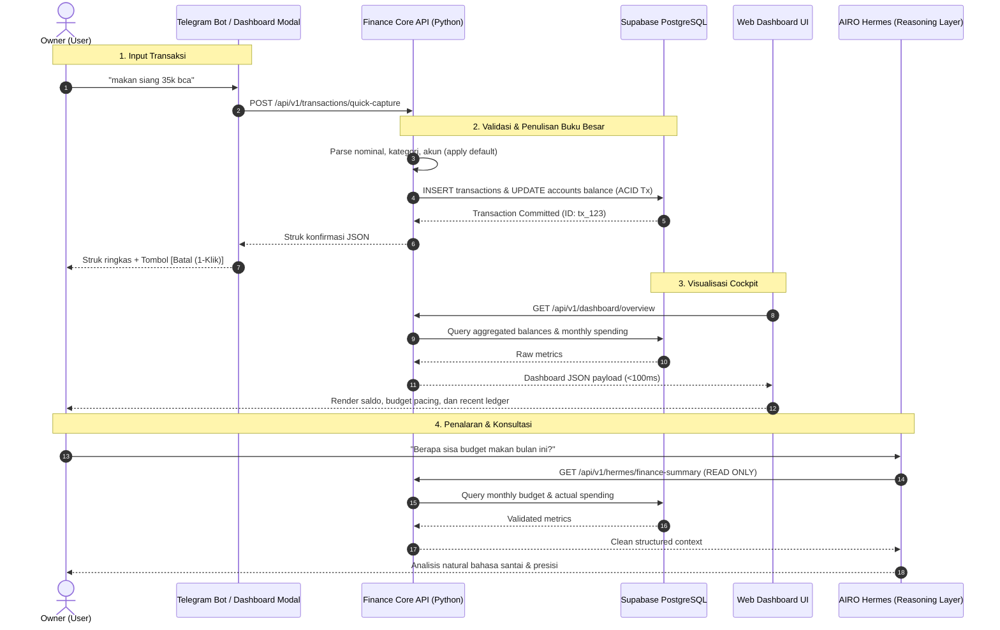
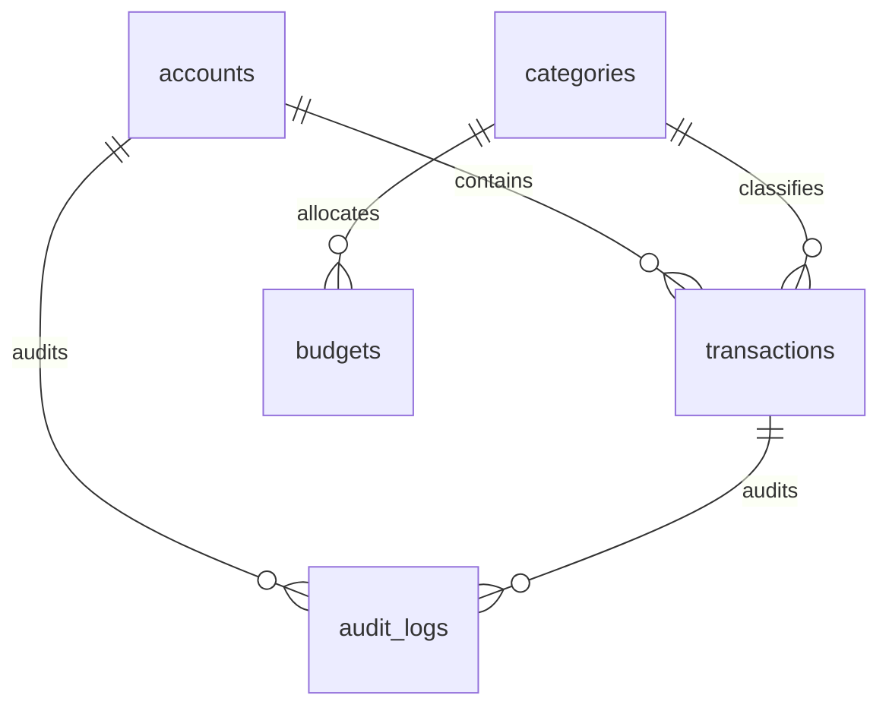

# AIRO Finance Lab — MVP Architecture Specification (v1.0)

- **Project**: `AIRO_FINANCE_LAB`
- **Document ID**: `AIRO_FINANCE_LAB_MVP_ARCHITECTURE_V1`
- **Status**: `LOCKED_PHASE_0_CANONICAL`
- **Date**: `2026-09-11`
- **Task**: `AIRO_FINANCE_LAB_PHASE0_DOCUMENTATION_LOCK_V1`
- **Product Identity Lock**: **Personal Finance Intelligence Application**
- **Architecture Triad**: Dashboard + Telegram Capture + Finance Core + AIRO Hermes Intelligence Layer

---

## 1. End-to-End Target Data Flow

Sistem mengadopsi aliran data satu arah (*unidirectional data flow*) dengan batasan otoritas yang tegas:



---

## 2. MVP Database Schema (Strictly 5 Tables Only)

Untuk menjamin kesederhanaan eksekusi, performa maksimal, dan mencegah *overengineering*, database MVP **HANYA BERISI 5 TABEL UTAMA**:



### 2.1 Table Definitions (PostgreSQL DDL)

#### 1. `accounts` (Penyimpanan Rekening & Saldo)
Menampung seluruh dompet dan rekening likuid milik Owner.
```sql
CREATE TYPE account_type AS ENUM ('CASH', 'BANK', 'E_WALLET', 'CREDIT_CARD');

CREATE TABLE accounts (
    id UUID PRIMARY KEY DEFAULT gen_random_uuid(),
    name TEXT NOT NULL UNIQUE, -- 'BCA Utama', 'Blu BCA', 'Cash Dompet'
    account_type account_type NOT NULL,
    current_balance NUMERIC(15, 2) NOT NULL DEFAULT 0.00,
    is_active BOOLEAN NOT NULL DEFAULT TRUE,
    created_at TIMESTAMPTZ NOT NULL DEFAULT NOW(),
    updated_at TIMESTAMPTZ NOT NULL DEFAULT NOW()
);
```

#### 2. `categories` (Hierarki Kategori Sederhana)
Menampung pengelompokan anggaran pengeluaran dan pemasukan.
```sql
CREATE TYPE category_direction AS ENUM ('EXPENSE', 'INCOME', 'TRANSFER');

CREATE TABLE categories (
    id UUID PRIMARY KEY DEFAULT gen_random_uuid(),
    name TEXT NOT NULL UNIQUE, -- 'Makanan & Minuman', 'Transportasi', 'Tagihan'
    direction category_direction NOT NULL DEFAULT 'EXPENSE',
    icon TEXT, -- Lucide icon identifier e.g. 'utensils', 'car'
    created_at TIMESTAMPTZ NOT NULL DEFAULT NOW()
);
```

#### 3. `transactions` (Buku Besar Transaksi Tunggal & Atomik)
Buku besar otoritatif pencatat mutasi uang masuk, keluar, dan transfer.
```sql
CREATE TYPE transaction_status AS ENUM ('CONFIRMED', 'VOIDED');

CREATE TABLE transactions (
    id UUID PRIMARY KEY DEFAULT gen_random_uuid(),
    account_id UUID NOT NULL REFERENCES accounts(id) ON DELETE RESTRICT,
    destination_account_id UUID REFERENCES accounts(id) ON DELETE RESTRICT, -- Diisi jika direction='TRANSFER'
    category_id UUID REFERENCES categories(id) ON DELETE RESTRICT,
    amount NUMERIC(15, 2) NOT NULL CHECK (amount > 0),
    direction category_direction NOT NULL,
    status transaction_status NOT NULL DEFAULT 'CONFIRMED',
    transaction_date DATE NOT NULL DEFAULT CURRENT_DATE,
    raw_text TEXT, -- Teks asli yang dikirim Owner via Telegram
    note TEXT,
    source_channel VARCHAR(32) NOT NULL DEFAULT 'TELEGRAM', -- 'TELEGRAM', 'DASHBOARD'
    created_at TIMESTAMPTZ NOT NULL DEFAULT NOW()
);
```

#### 4. `budgets` (Amplop Anggaran Bulanan)
Plafon alokasi pengeluaran per kategori per bulan.
```sql
CREATE TABLE budgets (
    id UUID PRIMARY KEY DEFAULT gen_random_uuid(),
    category_id UUID NOT NULL REFERENCES categories(id) ON DELETE CASCADE,
    period_year INT NOT NULL,
    period_month INT NOT NULL CHECK (period_month BETWEEN 1 AND 12),
    allocated_amount NUMERIC(15, 2) NOT NULL CHECK (allocated_amount >= 0),
    created_at TIMESTAMPTZ NOT NULL DEFAULT NOW(),
    UNIQUE(category_id, period_year, period_month)
);
```

#### 5. `audit_logs` (Jejak Rekam Mutasi & Keamanan)
Catatan setiap mutasi penting untuk mencegah data korup.
```sql
CREATE TABLE audit_logs (
    id UUID PRIMARY KEY DEFAULT gen_random_uuid(),
    entity_name VARCHAR(64) NOT NULL, -- 'transactions', 'accounts'
    entity_id UUID NOT NULL,
    action VARCHAR(16) NOT NULL, -- 'INSERT', 'VOID', 'UPDATE'
    actor VARCHAR(64) NOT NULL, -- 'TELEGRAM_BOT', 'WEB_DASHBOARD', 'SYSTEM'
    before_state JSONB,
    after_state JSONB,
    created_at TIMESTAMPTZ NOT NULL DEFAULT NOW()
);
```

---

## 3. Strict Boundary & Data Ownership Contract

Pemisahan tanggung jawab antar komponen dijamin melalui kontrak arsitektur berikut:

| Komponen | Peran Arsitektur | Hak Akses Database | Kewenangan & Batasan |
|---|---|---|---|
| **Finance Core API** | **Financial Source of Truth** | Read / Write Penuh | Pemilik tunggal logika saldo, validasi atomik, dan kalkulasi mutasi. Semua operasi tulis wajib lewat layer ini. |
| **AIRO Hermes** | **Reasoning & Intelligence** | **READ ONLY (Zero Writes)** | Mengonsumsi context API agregat. Dilarang keras melakukan penulisan SQL langsung atau mengubah status buku besar. |
| **Web Dashboard** | **Presentation Layer** | Read / Write via Core API | Menyajikan UI visual, grafik, dan modal input manual. Memanggil Finance Core API untuk mutasi data. |
| **Spreadsheet** | **Export / Reporting Mirror** | Pasif (Eksternal) | Sinkronisasi ekspor berkala/on-demand CSV. Nol kewenangan transaksional. Rusaknya rumus sheet tidak merusak database. |

---

## 4. Anti-Overengineering Guardrails

1. **Dilarang Menambah Tabel Kompleks**: Tabel `assets`, `liabilities`, `attachments`, `sync_jobs`, dan `ingestion_events` secara tegas **DITUNDA** ke fase berikutnya.
2. **Dilarang Jurnal Akuntansi Ganda Kompleks**: Transaksi dicatat secara atomik (nominal, akun, arah, kategori). Tidak ada akun beban/debit/kredit abstrak.
3. **Runtime Python Deterministik**: Backend dibangun di atas FastAPI/SQLModel di Linux/WSL2, sepenuhnya memutus dependensi terhadap runtime Google Apps Script.
