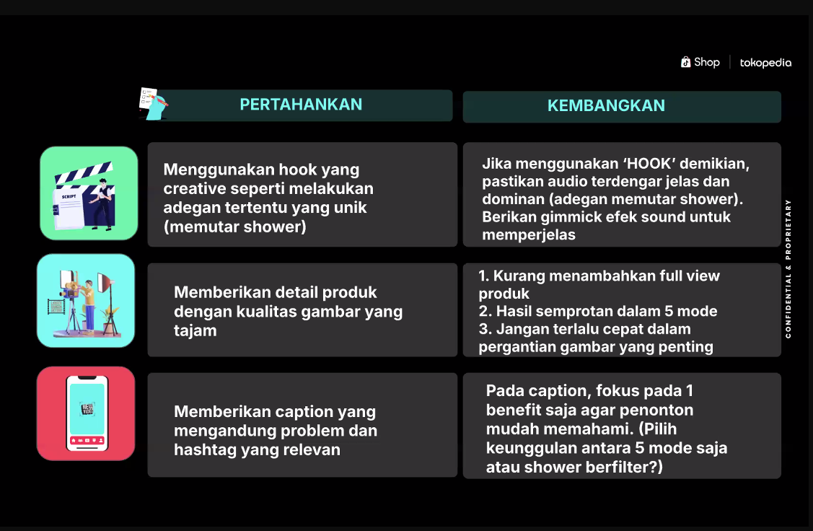

# Belajar

- Hook
    - 5 Hook Fyp
        
        **Panduan Membuat Hook yang Menarik untuk Konten TikTok**
        
        1.	**Tampilkan Kejutan**
        
        •	**Contoh Umum:** “Jujur, tidak nyangka bisa dapat __________.”
        
        •	**Contoh Khusus:** “Jujur, tidak nyangka bisa dapat skincare seharga Rp 20 ribuan!”
        
        2.	**Peringatan yang Kuat**
        
        •	**Contoh Umum:** “Stop lakukan hal ini! Kalau kamu tidak mau __________.”
        
        •	**Contoh Khusus:** “Stop lakukan hal ini! Kalau kamu tidak mau bisnis kamu rugi ratusan juta.”
        
        3.	**Tanya Provokatif**
        
        •	**Contoh Umum:** “Orang gila mana yang belum mulai __________?”
        
        •	**Contoh Khusus:** “Orang gila mana yang belum mulai konten sampai hari ini?”
        
        4.	**Janji Keuntungan Besar**
        
        •	**Contoh Umum:** “Dengan modal segini bisa dapat __________.”
        
        •	**Contoh Khusus:** “Dengan modal Rp 100 ribu, bisa dapat untung sampai Rp 10 juta per hari.”
        
        5.	**Rasa Penyesalan**
        
        •	**Contoh Umum:** “Nyesel banget baru tahu __________.”
        
        •	**Contoh Khusus:** “Nyesel banget baru tahu kalau konten dari rumah bisa menghasilkan sampai Rp 50 juta per bulan.”
        
        **Tips Tambahan**
        
        •	**Tampilkan Data atau Angka:** Penggunaan angka konkret menarik perhatian dan memberikan kepercayaan.
        
        •	**Ajak Interaksi:** Akhiri dengan pertanyaan atau ajakan untuk berkomentar, seperti: “Menuju 100 ribu followers, pengen dapat apa dari Mbak Citra? Tulis di kolom komentar. Terima kasih!”
        

- 4 Alasan Konten Stuck
    
    "VIRAL! 4 ALASAN Kenapa Kontenmu STUCK dan Cara MENGATASINYA! 🔥"
    
    Guys! Kalian pernah nggak sih bikin konten udah capek-capek tapi engagement-nya gitu-gitu aja? 🤔
    
    Nih, katanya ada 4 tanda kalau konten kita butuh "pertolongan pertama":
    
    1. Views cuma dikit ❌
    2. Sepi komen 📝
    3. Jarang di-save 🏷️
    4. Minim share 🔄
    
    Tapi tenang... Ada SOLUSI JITUNYA! ✨
    
    PERTAMA: Views Dikit?
    Tips rahasia dari top creator:
    
    - Bikin hook yang "auto pause" di 3 detik pertama
    - Tambahin visual yang bikin gregetan (contoh: cheese pull buat konten makanan 🧀)
    - Pake sound effect di bagian penting *boom effect*
    
    KEDUA: Sepi Komen?
    Coba trik ampuh ini:
    
    - Kasih pertanyaan di akhir: "Kalian #TeamMalam atau #TeamPagi nih?"
    - Bikin konten yang relatable. Misalnya: "5 Hal Yang Cuma Dipahami Anak Kos!" 🏠
    
    KETIGA: Jarang Di-save?
    
    - Pastikan kontenmu worth it untuk disimpan
    - Kasih value yang BENER-BENER dibutuhin target audiencemu
    Contoh: "3 Template Canva GRATIS Buat Konten Minggu Ini!"
    
    KEEMPAT: Minim Share?
    
    - Konten harus TO THE POINT! ⚡
    - Sesuaikan dengan interest audience
    - Bikin yang gampang dishare ke temen
    
    BONUS TIP! 💡
    Sebelum upload, tanya ke diri sendiri:
    "Kalo aku jadi audience, bakal share nggak ya konten ini ke temen?"
    
    Save video ini buat reminder! ⬇️
    Drop "✨" kalo konten ini membantu!
    Share ke temen yang butuh! 🚀
    
- Panduan Tiktok Affiliate
    - Panduan
        
        Pedoman Konten
        
        25/09/2024
        
        1. **Ringkasan ​**
        
        **1.1 Pengantar​**
        
        Tujuan dari **Pedoman Konten Shop** ini adalah:​
        
        - Membangun lingkungan belanja yang positif di platform kami; dan ​
        - Memberikan pengalaman berbelanja yang dapat dipercaya oleh pengguna.​
        
        Pengguna dan penjual yang membuat dan membagikan konten e-commerce harus mengikuti pedoman ini. Pengguna yang membuat konten e-commerce disebut sebagai "Kreator" di bawah ini.​
        
        **1.2 Cakupan​**
        
        **Pedoman Konten** **Shop** kami mencakup semua konten yang dibuat, diunggah dan dibagikan di platform kami.​
        
        Kreator tidak boleh membuat, memposting, mengunggah, menyiarkan, atau membagikan:​
        
        - Konten yang terkait dengan produk yang tidak sepenuhnya mematuhi hukum berlaku di pasar tujuan​
        - Konten yang terkait dengan produk yang isinya menyesatkan, tidak lengkap, atau memperlakukan pengguna secara tidak adil ​
        - Konten yang dapat memengaruhi pengalaman belanja pengguna secara negatif (seperti konten yang tidak orisinal atau berkualitas rendah).​
        
        Catatan Penting: Kreator bertanggung jawab memastikan konten di platform kami selalu mematuhi hukum dan peraturan yang berlaku. Pedoman ini tidak lengkap dan tidak dimaksudkan sebagai nasihat hukum. Jika mereka memiliki pertanyaan terkait undang-undang dan peraturan tentang konten mereka, mereka dapat berkonsultasi dengan penasihat hukum mereka.​
        
        Pedoman pada halaman ini diperbarui secara berkala. Silakan mengecek halaman ini secara teratur untuk memastikan Anda (sebagai kreator) telah mematuhi pedoman kami saat ini.​
        
        1. **Definisi​**
        - **"Kreator"** mengacu kepada semua pengguna yang membuat konten e-commerce.​
        - **Penjual** mengacu kepada semua pengguna terdaftar yang menggunakan platform kami untuk menjual produk.​
        - **"Konten"** mengacu kepada semua bentuk media yang dapat diunggah oleh kreator ke Shop. Ini mencakup semua format seperti etalase toko e-commerce, video, dan LIVE.​
        - **"Produk Terlarang"** mengacu kepada produk yang tidak bisa dijual karena dilarang oleh hukum atau peraturan setempat.​
        - **"Produk Terbatas"** mengacu kepada jenis produk yang memerlukan persetujuan terlebih dahulu dari kami untuk dijual. Penjual yang ingin menjual produk terbatas harus melewati proses persetujuan produk. Proses tersebut mungkin mengharuskan penjual menyerahkan dokumen termasuk namun tidak terbatas pada sertifikasi, laporan pengujian, gambar produk atau paket, dan dokumen lainnya.​
        - **"Konten Tidak orisinal"** mengacu kepada media yang diunggah/diimpor dan pengguna belum menambahkan pengeditan baru atau kreatif.​
        - **"HFSS"** mengacu kepada Tinggi Lemak jenuh, Garam dan Gula. Ini adalah deskripsi dari makanan tertentu.​
        1. **Kategori Konten Terlarang​**
        
        Semua konten yang diunggah ke platform kami harus mengikuti pedoman ini. Halaman sampul, judul, hyperlink, tautan, deskripsi, cara berbicara, pakaian, perilaku, suara, pengaturan mikrofon, nama panggilan, perkenalan pribadi, gambar, dan fitur lainnya juga mengikuti pedoman ini. ​
        
        Beberapa daftar kategori konten yang dilarang di platform kami .​
        
        **3.1 Kegiatan ilegal atau kriminal​**
        
        Kami melarang semua konten yang berisi atau mempromosikan segala bentuk aktivitas ilegal atau kriminal. Konten akan dihapus dari platform jika melanggar hukum atau peraturan regional.​
        
        Kreator tidak boleh memposting, mengunggah, menyiarkan, atau membagikan:​
        
        - Layanan perjudian, atau konten yang dapat dianggap sebagai iklan untuk kasino, taruhan olahraga, atau aktivitas perjudian komersial. Untuk informasi lebih lanjut, silakan cek [Pedoman Shop terkait Perjudian, Gamifikasi, Giveaway Gratis, dan Insentif](https://seller-id.tiktok.com/university/essay?knowledge_id=2954951123207938&role=1&course_type=1&from=search&identity=1) berbasis pembelian.​
        - Phishing​
        - Ponzi, pemasaran berjenjang (multi-level marketing), atau skema piramida​
        - Skema investasi yang menjanjikan pengembalian tinggi​
        - Taruhan yang diatur, atau jenis penipuan lainnya​
        - Eksploitasi manusia, termasuk penyelundupan manusia, kerja paksa, pembantu rumah tangga, perdagangan seks, atau prostitusi​
        - Vandalisme atau perusakan properti.​
        - Perburuan atau perdagangan ilegal satwa liar​
        - Pembelian, penjualan, perdagangan, atau permintaan barang yang diperoleh secara tidak sah atau barang palsu​
        
        **3.2 Produk Terlarang dan Tidak Didukung ​**
        
        Semua produk yang ditampilkan atau dipromosikan di semua konten atau LIVE harus mematuhi semua peraturan perundang-undangan setempat serta [Pedoman Komunitas TikTok](https://www.tiktok.com/community-guidelines?lang=en). Selain itu, dilarang keras membuat konten apa pun yang menampilkan atau mempromosikan Produk Terlarang atau Tidak Didukung. ​
        
        Kami berhak (menurut kebijakan kami semata) untuk menentukan pantas tidaknya sebuah daftar produk, LIVE, atau video. Jika kami menentukan bahwa suatu produk dilarang, ilegal, atau tidak pantas, kami dapat menghapusnya.​
        
        **3.3 Produk yang Dibatasi​**
        
        Kreator dilarang mendaftarkan, menjual, atau mempromosikan konten apa pun yang terkait dengan Produk yang Dibatasi, kecuali mendapat semua persetujuan kategori yang diperlukan (atau diberitahukan kepada Anda oleh kami). Jika ingin menjual produk dalam daftar **produk yang dibatasi**, Penjual/Kreator harus memperoleh persetujuan wajib yang tercantum dalam [Pedoman Produk yang Dibatasi dan Tidak Didukung Shop](https://seller-id.tiktok.com/university/essay?knowledge_id=7753815881352962&role=1&identity=1).​
        
        Walaupun Produk yang Dibatasi diperbolehkan untuk dijual di platform kami , iklan produk tertentu bergantung pada peraturan perundang-undangan setempat. Kreator harus mematuhi semua peraturan perundang-undangan setempat ketika mempromosikan produk.​
        
        **3.4 Pelanggaran Hak Sah​**
        
        Kreator tidak boleh mempublikasikan atau mendistribusikan konten yang melanggar atau mendorong pelanggaran atas Hak Kekayaan Intelektual atau hak pribadi orang lain.​
        
        Jangan memposting, mengunggah, menyiarkan, atau membagikan:​
        
        - Konten yang menggunakan merek atau logo untuk keuntungan komersial (kecuali jika mereka memiliki izin dari pemilik merek).​
        - Foto dan nama orang (untuk tujuan komersial) tanpa izin tertulis dari pihak individu itu sendiri. Ini termasuk produk yang disponsori (*endorsement*), *merchandise*, serta penggunaan atau koleksi gambar selebriti yang tidak sah.​
        
        Silakan cek [Kebijakan Kekayaan Intelektual Shop](https://seller-id.tiktok.com/university/essay?knowledge_id=10001387&role=1&identity=1) kami untuk rincian selengkapnya.​
        
        **3.5 Keamanan Anak Di Bawah Umur​**
        
        Walaupun produk anak-anak boleh ditampilkan di unggahan video atau LIVE, konten tersebut dilarang menyasar anak-anak dengan cara apa pun (seperti yang dijelaskan dalam undang-undang setempat). Kreator dilarang memublikasikan atau menyebarkan konten apa pun yang mempromosikan produk atau penawaran komersial kepada anak-anak.​
        
        Kreator dilarang memposting, mengunggah, menyiarkan, atau membagikan.​
        
        - Konten apa pun yang membujuk anak-anak untuk membeli produk atau layanan.​
        - Konten apa pun yang menyebabkan anak-anak untuk meminta orang tua/wali mereka membeli produk atau layanan.​
        - Konten lainnya yang berdampak negatif terhadap anak-anak, sebagaimana ditentukan oleh platform kami atas kebijaksanaannya semata (bertindak secara wajar).​
        
        Jika video/LIVE menampilkan anak-anak yang mempromosikan produk, isi dari konten tersebut harus langsung berkaitan dengan produk yang dibahas. Selain itu, anak-tersebut wajib didampingi oleh orang dewasa penanggung jawab mereka yang turut ditampilkan dalam LIVE tersebut. Dilarang keras menampilkan konten yang mengandung segala bentuk ketelanjangan atau hal yang menjurus ke arah seksual yang melibatkan anak di bawah umur, seperti model untuk pakaian renang atau pakaian dalam.​
        
        Marketplace tertentu mungkin memiliki persyaratan lainnya terkait anak di bawah umur sesuai dengan undang-undang setempat yang berlaku (seperti dilarang menampilkan anak-anak/anak di bawah umur untuk konten komersial). Kreator harus memastikan konten dan produk yang diunggah memenuhi semua peraturan perundang-undangan yang berlaku. ​
        
        **3.6 Konten Sensasional atau Mengejutkan​**
        
        Kreator dilarang mengunggah atau membagikan konten sensasional atau mengejutkan yang mungkin menyebabkan ketidaknyamanan bagi pengguna.​
        
        Kreator dilarang untuk memposting, mengunggah, menyiarkan atau membagikan konten:​
        
        - Kekerasan atau gambar kematian/kecelakaan​
        - Sisa tubuh manusia yang dipotong, dimutilasi, hangus, atau dibakar​
        - Hal-hal sadis - dengan luka terbuka atau cedera yang menjadi fokus utama​
        - Kekerasan fisik, perkelahian, atau penyiksaan di dunia nyata​
        - Hasrat seksual, rangsangan seksual, atau fetish seksual​
        - Pembunuhan hewan atau kematian hewan yang tidak alami lainnya​
        - Sisa tubuh hewan yang dipotong, dimutilasi, hangus, atau dibakar​
        - Kekejaman dan perilaku sadis terhadap hewan​
        
        **3.7 Konten yang Menyesatkan atau Palsu​**
        
        Kreator dilarang mengunggah atau membagikan konten yang berisi informasi atau promosi menyesatkan.​
        
        **3.7.1 Tampilan Informasi Menyesatkan ​**
        
        Semua konten harus konsisten dengan produk yang sebenarnya dijual dan tidak boleh menyesatkan. Semua informasi yang ditampilkan di konten harus sama dengan informasi yang tertera di daftar produk terkait. ​
        
        Kreator/Penjual tidak boleh menampilkan informasi yang menyesatkan seperti:​
        
        - Harga atau diskon yang tidak konsisten​
        - Gambar, nama merek, deskripsi, atribut utama, model, garansi produk, atau jaminan palsu​
        - Setiap informasi palsu mengenai layanan seperti pengiriman, logistik, pengembalian barang, pengembalian dana, dan layanan pelanggan.​
        - Setiap informasi yang mengklaim atau menyiratkan suatu produk memiliki sifat atau efek yang belum terbukti.​
        
        **3.7.2 Klaim yang Berlebihan​**
        
        Semua konten tidak boleh berisi klaim yang berlebihan tentang kinerja atau efek produk. Ini termasuk, namun tidak terbatas pada klaim medis tentang efek produk pada tubuh manusia. Sebagian jenis klaim lainnya yang berlebihan, termasuk:​
        
        - Menggunakan gambar sebelum dan sesudah untuk menunjukkan performa atau efek produk pada tubuh manusia (misalnya foto penurunan berat badan, foto penghilangan jerawat/bekas luka/bintik hitam, dll.)​
        - Mengklaim bahwa produk akan efektif tanpa bukti apa pun (misalnya “Lihat hasilnya dalam 3 hari”, “Mengatasi rambut rontok dalam 1 minggu”, “Produk ini akan menjadikan bibir Anda merah muda secara permanen”, dll.) ​
        - Mengklaim bahwa produk dapat memulihkan/mencegah/menyembuhkan/mengobati kondisi atau gejala medis apa pun (misalnya klaim bahwa suatu produk dapat menyembuhkan penyakit jantung, mencegah keriput, mengobati infeksi/alergi kulit, dll.)​
        - Membuat klaim yang tidak didukung oleh bukti ilmiah yang ditinjau oleh rekan sejawat (misalnya, "Produk ini akan membantu Anda menurunkan 10 pon dalam 3 hari" dll.)​
        
        **3.7.3 Deskripsi yang Berlebihan ​**
        
        Semua konten tidak boleh berisi deskripsi berlebihan atau klaim mutlak tanpa bukti terkait, valid, objektif, independen, dan dapat diverifikasi untuk mendukung klaim tersebut. Sebagai contoh:​
        
        - "Produk No. 1 di Asia"​
        - "100% natural atau alami"​
        
        **3.7.4 Konten yang Membandingkan/Menjatuhkan ​**
        
        Semua konten tidak boleh mengandung perbandingan yang bersifat merendahkan atau komentar merendahkan yang ditujukan kepada produk, merek, atau situs e-commerce lainnya. Sebagai contoh:​
        
        - "Produk kami lebih efektif daripada produk XX."​
        - "Produk ini harganya XX lebih murah daripada di situs ABC."​
        
        **3.7.5 Klaim Palsu​**
        
        Semua konten tidak boleh membuat klaim palsu mengenai produk. Sebagai contoh:​
        
        - Klaim palsu bahwa produk telah memenangkan banyak penghargaan atau memiliki beragam sertifikasi​
        - Klaim palsu bahwa suatu produk berafiliasi dengan produk lain​
        - Klaim palsu mengenai asal produk ​
        - Melebih-lebihkan harga promosi atau membuat perbandingan harga tanpa dukungan tidak diperbolehkan. Semua klaim harga, termasuk harga promosi, harus akurat.​
        
        **3.7.6 Filter Kecantikan yang Menyesatkan ​**
        
        Kreator tidak boleh menggunakan filter kecantikan yang menyesatkan untuk produk kecantikan dan perawatan pribadi. ​
        
        Selain contoh di atas, mungkin terdapat persyaratan lebih lanjut untuk klaim produk tertentu di pasar tujuan masing-masing kreator. Kreator harus meninjau pedoman, hukum, dan peraturan yang relevan di pasar tujuan mereka untuk memastikan bahwa konten mereka sepenuhnya mematuhi kebijakan.​
        
        **3.7.7 Janji Palsu terkait Imbalan/Keuntungan​**
        
        - Kreator tidak boleh menyesatkan pengguna dengan membuat janji palsu mengenai imbalan (finansial atau lainnya) kepada pelanggan. Hal ini termasuk namun tidak terbatas pada pemberian *giveaway*, insentif, hadiah, dan hadiah gratis yang bersifat janji palsu.​
        - Janji imbalan apa pun yang tidak ditindaklanjuti atau dipenuhi akan dianggap sebagai pesanan yang tidak dipenuhi jika terjadi perselisihan pelanggan.​
        - Untuk informasi lebih lanjut, silakan lihat [Pedoman Perjudian, Gamifikasi, Giveaway Gratis, dan Insentif Berbasis Pembelian Shop](https://seller-id.tiktok.com/university/essay?knowledge_id=2954951123207938&role=1&course_type=1&from=search&identity=1) kami.​
        
        **3.7.8 Lelang dan Manipulasi Harga​**
        
        - Platform kami dengan tegas melarang para kreator untuk terlibat dalam bentuk apa pun dari lelang atau aktivitas berbasis lelang di platform ini. Aktivitas tersebut mencakup, namun tidak terbatas pada, mengajukan penawaran, menawarkan atau meminta penawaran, dan segala perilaku alternatif serupa. Para kreator juga dilarang mengarahkan pengguna ke aktivitas lelang di platform eksternal atau pihak ketiga.​
        
        **3.7.9 Perilaku Pengelabuan Daftar Produk​**
        
        Saat melakukan LIVE atau membuat video, penjual dan kreator harus memastikan bahwa produk yang mereka tampilkan sama dengan yang ditampilkan dalam produk tertaut atau terdaftar.​
        
        Penjual dan kreator tidak boleh terlibat dalam perilaku pengelabuan daftar produk seperti:​
        
        - Mempromosikan produk yang tidak sesuai dengan daftar produk yang ditautkan.​
        - Iklan produk dan daftar produk tidak cocok.​
        - Mempromosikan atau menyembunyikan produk yang dilarang atau tidak didukung dalam konten atau daftar produk.​
        - **Terlibat dalam perilaku apa pun untuk menghindari fitur daftar produk Shop.​**
        
        **3.8 Pengalihan yang Menyesatkan, Spam, dan Penipuan ​**
        
        Semua konten dilarang menyertakan segala macam bentuk spam atau penipuan dalam profil, konten, komentar, atau obrolan pengguna.​
        
        Kreator **dilarang keras:**​
        
        - Menyamar sebagai individu atau organisasi lain untuk mengelabui publik atau membuat pernyataan jahat​
        - Memanipulasi mekanisme platform demi menghasilkan pesanan, jumlah tayangan, jumlah suka, komentar, pengikut, atau ulasan/peringkat positif pelanggan secara artifisial​
        - Menggunakan beberapa akun untuk mendistribusikan LIVE yang sama​
        - Terlibat dalam aktivitas yang mengelabui konsumen atau memengaruhi mereka untuk memesan, menyukai, mengomentari, atau lainnya​
        - Mempromosikan produk dengan memancing simpati dari pembeli ​
        - Mempromosikan layanan penghasil trafik artifisial​
        - Menciptakan perangkat lunak berbahaya atau memodifikasi kode untuk meningkatkan pesanan, jumlah tayangan, jumlah suka, pengikut, jumlah dibagikan, atau komentar secara artifisial​
        - Upaya lain apa pun untuk mendorong pengguna ke laman utama yang tidak resmi. Hal-hal berikut juga dilarang:​
        - Laman utama yang tidak valid​
        - Laman utama yang meminta informasi pribadi pengguna untuk melanjutkan​
        - Laman utama yang secara otomatis mengunduh file ke komputer seseorang​
        - Terlibat dalam perilaku yang bertujuan meningkatkan interaksi pengguna secara fiktif atau mengakali sistem rekomendasi platform kami . Ini mencakup (namun tidak terbatas pada) perilaku, seperti:​
        - Melakukan LIVE atau mengunggah konten yang bertujuan mengakali atau memanipulasi pihak lain untuk meningkatkan jumlah pengikut, suka, atau jumlah tayangan.​
        - Memfasilitasi jual beli layanan yang meningkatkan interaksi secara fiktif, misalnya jual beli pengikut atau suka.​
        - Memberikan tutorial tentang cara meningkatkan interaksi secara fiktif di TikTok.​
        - Menggunakan konten yang mengakali atau memanipulasi pihak lain untuk meningkatkan metrik interaksi, misalnya perjanjian "*like-for-like*" (saling menyukai konten) dan insentif palsu sebagai imbalan berinteraksi.​
        
        **3.8.1 Pengalihan Trafik​**
        
        - Kami tidak dapat menjamin keamanan transaksi/aktivitas yang terjadi di luar platform kami. Kami dapat menghapus konten yang berisi tautan, referensi, atau '*calls to action*' lainnya, yang akan mendorong pengguna untuk meninggalkan platform kami (atau mengarahkan mereka ke platform atau situs web lain). Ini termasuk namun tidak terbatas pada situs web lain, nomor telepon, media sosial, alamat email, kode QR, atau aktivitas di luar platform lainnya di luar kendali kami .​
        - **Catatan:** Penjual atau kreator yang terlibat dalam pengalihan trafik pengguna terkait produk bermerek atau hak kekayaan intelektual mungkin akan dikenai sanksi tambahan atau yang lebih berat. ​
        - Selain itu, untuk melindungi pengalaman pengguna, menghindari kebingungan saat berbelanja dan melindungi konsumen dari iklan yang berpotensi menyesatkan, kreator dilarang untuk melibatkan diri dalam ***simulcasting*** atau **LIVE secara bersamaan** di berbagai platform (selanjutnya disebut sebagai "multi-platform Livestreaming" atau "simulcasting"). Simulcasting mencakup penggunaan alat atau perangkat lunak pihak ketiga untuk menyiarkan konten LIVE secara bersamaan di berbagai platform.​
        - **Catatan**: Simulcasting dilarang demi menjaga kualitas dan keamanan platform dan melindungi pengalaman pengguna. Kreator tidak dilarang untuk dan masih bisa melakukan LIVE di platform lain, hanya saja tidak melakukannya secara bersamaan. ​
        
        **3.9 Konten Tidak Orisinal, Berkualitas Rendah dan Tidak Relevan ​**
        
        **3.9.1 Konten Plagiat dan Rekaman ​**
        
        **Konten Plagiat** adalah konten yang tidak dibuat sendiri oleh kreator. Konten Plagiat tidak boleh ditayangkan di **LIVE dan video e-commerce.** Ini termasuk, namun tidak terbatas pada:​
        
        - Materi berhak cipta, seperti film, acara televisi, dan pertandingan olahraga​
        - Audio LIVE atau promosi dari kreator atau platform lain ​
        - Video dari kreator atau platform lain yang diunggah ulang di platform kami ​
        
        **Catatan:** Kreator boleh mengunggah video milik Kreator lain jika telah mendapatkan izin eksplisit dari Kreator pemilik konten.​
        
        **Konten Rekaman** adalah konten audio dan visual yang tidak ditayangkan secara real-time. Konten Rekaman (audio & video) tidak boleh ditayangkan di **LIVE e-commerce**. Kreator harus menayangkan LIVE secara real-time.​
        
        **3.9.2 Konten Non-Interaktif dan Berkualitas Rendah​**
        
        Konten yang dianggap berkualitas rendah dan mungkin menghadapi tindakan penegakan meliputi:​
        
        - Video pendek terutama yang hanya terdiri dari gambar diam, overlay gambar diam, overlay teks digital, tangkapan layar (*screenshoot*), rekaman layar. Adegan diam, konten yang statis tanpa interaksi langsung antara individu atau dengan penonton selama *Livestreams*.​
        - Siaran serentak yang dilakukan di 2 platform selain TikTok.​
        - Konten tertulis, lisan, atau visual apa pun yang berisi bahasa yang tidak pantas sebagaimana ditentukan oleh Shop | Tokopedia atas kebijakannya sendiri. Hal ini termasuk bahasa yang tidak baik, vulgar, atau cabul, serta bahasa apa pun yang mengandung kata-kata kotor, konten grafis/sugestif, atau bermakna ganda.​
        
        **3.9.3 Konten Promosi yang Tidak Relevan ​**
        
        Di platform kami, kreator dapat membuat konten seperti *live streaming* dan video untuk mempromosikan produk. Kreator harus memastikan bahwa mereka mempromosikan produk secara akurat. Semua konten promosi (seperti livestream dan video) harus relevan dengan produk yang dijual.​
        
        Berikut ini adalah contoh situasi konten promosi yang tidak relevan: ​
        
        - Produk yang ditampilkan di dalam video tidak disebutkan di *landing page.* ​
        - Produk tidak ditampilkan dan dipromosikan secara eksplisit di dalam konten, *live streaming*, atau video. Hal ini biasanya termasuk kreator melakukan aktivitas tanpa menunjukkan, memperkenalkan, mempromosikan, atau berbicara tentang produk yang relevan.​
        - Produk yang ditampilkan di konten kreator tidak cocok dengan produk yang di landing page*.*​
        
        **3.10 Konten Lainnya​**
        
        Semua konten yang diunggah tidak boleh mengandung virus, malware, spyware, trojan, phishing, atau kode berbahaya lainnya yang dapat melanggar atau mengakali tindakan keamanan platform kami.​
        
        Kami juga melarang jenis konten lain yang dianggap menyinggung menurut hukum, peraturan, budaya lokal, dan konvensi sosial setempat.​
        
        Kami berupaya melindungi pengalaman pelanggan. Oleh karena itu, kami berhak mengambil tindakan penegakan hukum terhadap kreator mana pun yang dianggap berdampak negatif terhadap pelanggan (baik pedoman ini secara eksplisit melarang konten mereka atau tidak).​
        
        **3.11 Konten Pengontrol Berat Badan​**
        
        Kami melarang segala bentuk konten pengontrol berat badan. Secara khusus, konten tidak boleh: ​
        
        - Mempromosikan citra tubuh yang tidak sehat atau hubungan yang tidak sehat dengan makanan.​
        - Mengklaim jaminan atau kemudahan untuk menurunkan atau menaikkan berat badan.​
        - Menjanjikan atau menjamin bahwa hanya dengan mengonsumsi produk, tanpa mengatur pola makan atau olahraga, dapat menurunkan atau menaikkan berat badan. ​
        - Menyertakan ilustrasi media tentang berat badan "sebelum dan sesudah" mengonsumsi produk.​
        - Menyatakan kandungan kalori dari produk tertentu, atau jumlah penurunan maupun peningkatan berat badan yang dapat dialami seseorang setelah mengonsumsi produk.​
        
        Perlu diingat bahwa kami memperbolehkan, hingga tingkat tertentu yang diizinkan oleh undang-undang yang berlaku, penjualan suplemen kebugaran, kesehatan, diet, dan kecantikan, selama konten mempromosikan produk tersebut. Namun, daftar produk tersebut tidak boleh membuat klaim sebagai pengontrol berat badan atau memasarkannya sebagai produk pengontrol berat badan. Penjualan atau iklan produk wajib mematuhi semua undang-undang yang berlaku. ​
        
        **3.12 Konten politik ​**
        
        Konten *e-commerce* tidak boleh mengandung referensi politik, seperti; ​
        
        - Penggambaran, referensi terhadap aktor politik (baik organisasi maupun individu) dan materi kampanye pemilu.​
        - Konten yang berkaitan dengan hasil pemilu atau keputusan politik, seperti;​
        - Merujuk, mempromosikan, atau menentang kandidat pejabat publik, partai politik, atau pejabat pemerintah yang dipilih/ditunjuk.​
        - Merujuk, mendukung, atau menolak pemilu dan hasil pemilu; baik pemilu yang telah terjadi, sedang berlangsung maupun yang akan datang. Dalam hal ini termasuk konten yang berisi pendaftaran pemilih, jumlah pemilih, dan permohonan perolehan suara.​
        - Merujuk, mendukung, atau mengkritik pemerintah, proses kelembagaan, kebijakan pemerintah, termasuk hasil atau proses legislatif, yudikatif, atau peraturan.​
        
        Kebijakan larangan ini dilakukan untuk:​
        
        - memastikan bahwa konten *e-commerce* hanya fokus pada produk yang dijual di platform. ​
        - memastikan agar semua orang mendapatkan pengalaman berbelanja yang menyenangkan. ​
        
        Atas dasar pengecualian, diperbolehkan sebuah konten *e-commerce* berisi kepentingan masyarakat, namun hanya berlaku di dalam aplikasi dan harus sesuai dengan kebijakan platform.​
        
        **3.13 Konten Berunsur Seksual​**
        
        Kreator dilarang memposting, mengunggah, melakukan LIVE, atau membagikan konten yang mengandung unsur seksual atau menjurus pada aktivitas seksual. Secara umum, konten yang melanggar standar moral, norma kesusilaan, dan norma kesopanan dilarang di TikTok. Ini termasuk, tetapi tidak terbatas pada:​
        
        **Konten yang Dikemas secara Seksual**​
        
        - Konten yang menggunakan sudut pengambilan atau pembingkaian gambar agar perhatian terpusat pada bagian intim tubuh tanpa bertujuan menunjukkan kegunaan atau fungsi produk.​
        - Individu yang berpose provokatif atau mengenakan pakaian yang vulgar saat mempromosikan produk.​
        
        **Menyiratkan Ketelanjangan**​
        
        - Konten yang memberikan kesan bahwa manusia (digital maupun non-digital) dalam konten tersebut sedang dalam keadaan telanjang. Termasuk mengaburkan atau menyensor bagian tubuh saat mempromosikan produk.​
        
        **Konten dengan Bahasa yang Mengandung Unsur Seksual**​
        
        - Konten yang membahas atau membicarakan aktivitas seksual saat mempromosikan produk, meski konteksnya bercanda atau satir. Ini termasuk penggunaan teks atau emoji yang menjurus.​
        
        **Menampilkan/Mengenakan Pakaian Tertentu yang Tidak Pantas**​
        
        - Konten yang menampilkan model hanya mengenakan celana dalam, pakaian dalam, atau pakaian renang **meski tujuannya untuk mempromosikan produk**. ​
        - Celana dalam, pakaian dalam, atau pakaian renang boleh dipakai **jika dikenakan dengan** pakaian yang pantas.​
        - Pakaian renang boleh dipakai tanpa mengenakan pakaian lainnya selama pemakainya berada di lokasi yang sesuai, seperti kolam renang atau pantai.​
        - Konten yang menampilkan model dengan pakaian intim (mis. pakaian dalam, celana dalam, dan pakaian renang) serta menampilkan lekuk bagian pribadi tubuh mereka (mis. puting perempuan atau bagian intim laki-laki). Ini termasuk menampilkan pakaian dalam lingerie erotis, thong, dan g-string.​
        - Menampilkan, melepas, atau mengatur posisi pakaian atau pakaian intim yang dikenakan dengan cara yang menjurus atau merangsang secara seksual.​
        
        **Mengklaim stimulasi atau performa seksual**​
        
        - Konten yang disertai klaim bahwa produk tertentu bisa menjaga atau membantu performa seksual atau memperbesar bagian intim tubuh. ​
        1. **Kategori Konten Terlarang Khusus​**
        
        **4.1 Kosmetik​**
        
        Semua konten yang diunggah atau dibuat terkait kosmetik tidak boleh mengandung hal-hal berikut:​
        
        - Frasa atau implikasi tentang pengobatan atau pencegahan penyakit apa pun​
        - Frasa atau implikasi yang mengeklaim dapat menyembuhkan, mendiagnosis, memperbaiki, mengatur, atau mengubah fungsi fisiologis​
        - Klaim yang menyiratkan bahwa produk tertentu memiliki efek farmakologis, imunologis, atau metabolik​
        - Klaim yang menyiratkan bahwa produk tertentu memperbarui, memperbaiki, atau mengubah fungsi fisiologis​
        - Pernyataan yang merujuk pada efek produk obat-obatan​
        
        Semua produk kosmetik adalah produk yang dipakai di bagian luar tubuh manusia. Selain itu, efek barang kosmetik tersebut harus bersifat sementara. ​
        
        Konten atau pernyataan tentang produk kosmetik tidak boleh menyesatkan dan **tidak boleh melanggar persyaratan apa pun yang ditentukan oleh undang-undang atau peraturan terkait**. Kami menanggapi promosi palsu produk kosmetik dengan sangat serius. Konten apa pun yang mengandung atau menyiratkan fungsi produk melebihi fungsi kosmetik akan dianggap melanggar kebijakan kami.​
        
        **4.2 Makanan​**
        
        Konten terkait makanan tidak boleh menyesatkan konsumen mengenai karakteristik, efek, atau khasiatnya. Kreator juga dilarang mengaitkan khasiat obat pada makanan.​
        
        Kreator tidak diperbolehkan menggunakan karakter berlisensi dalam iklan makanan dan minuman yang ditargetkan untuk anak-anak. Mereka juga dilarang menampilkan promosi penjualan pada konten yang ditujukan untuk anak-anak.​
        
        Untuk klaim kesehatan umum yang merujuk pada manfaat nutrisi atau makanan untuk kesehatan atau kesejahteraan seperti **“makanan super”, “buah super”, “penuh kebaikan”, “bahan yang baik”, “detoks”, “ detoksifikasi”, “kesejahteraan”**, klaim ini harus dibuktikan dengan dokumentasi atau sertifikasi yang relevan dari ahli kesehatan yang berwenang.​
        
        Konten yang menyatakan atau menyiratkan bahwa suatu jenis makanan/minuman/suplemen dapat mencegah, mengobati, atau menyembuhkan penyakit tidak diperbolehkan dalam keadaan apa pun. Klaim yang menyatakan bahwa produk dapat mengurangi penyakit hanya diperbolehkan dalam keadaan berikut:​
        
        - Menampilkan semua informasi dengan lugas dan tidak berlebihan​
        - Memiliki dokumen relevan dari badan kesehatan yang berwenang​
        - Platform kami tidak mengizinkan Kreator mempromosikan kebiasaan gizi buruk atau gaya hidup tidak sehat​
        
        **4.2.1 Makanan dan Minuman HFSS (Makanan tinggi lemak, garam atau gula)​**
        
        Kreator dilarang mengunggah:​
        
        - Konten terkait makanan atau minuman yang mendorong kebiasaan makan yang tidak sehat seperti konsumsi berlebihan​
        - Konten yang mempromosikan makanan tinggi lemak, garam, atau gula kepada anak-anak (usia 13-16 atau di bawah)​
        - Konten yang menyarankan makanan tinggi lemak, garam, atau gula adalah pengganti yang tepat untuk camilan yang lebih sehat​
        - Konten yang menampilkan panggilan khusus untuk membeli makanan tinggi lemak, garam, atau gula​
        
        *Kecuali iklan layanan masyarakat yang menampilkan makanan tinggi lemak, garam, atau gula semata-mata untuk mendidik masyarakat tentang pola makan sehat dan pilihan pola makan sehat.*​
        
        **Catatan:** Jika produk diklasifikasikan sebagai makanan tinggi lemak, garam, atau gula menurut peraturan lokal di pasar tujuan (misalnya karena mempromosikan produk, menampilkan merek, atau menonjolkan makanan tinggi lemak, garam, atau gula), kreator harus mengungkapkan klasifikasi ini ke kami . Selain itu, mereka mungkin diminta menyerahkan dokumen tambahan jika diminta.​
        
        **4.2.2 Susu Pertumbuhan dan Susu Formula Bayi ​**
        
        Kreator dilarang mengunggah konten yang mempromosikan:​
        
        - Produk susu formula lanjutan (untuk bayi usia 6 hingga 36 bulan)​
        - Produk susu formula bayi (untuk bayi usia 0 hingga 6 bulan)​
        
        **4.3 Obat Herbal ​**
        
        Kreator dilarang mengunggah konten yang mempromosikan obat herbal.​
        
        **4.4 Suplemen Kesehatan ​**
        
        Kreator dilarang mengunggah konten yang mempromosikan suplemen kesehatan, kecantikan, kebugaran, serta vitamin dan suplemen bayi dan ibu hamil.​
        
        1. **Tindakan Penegakan dan Audit​**
        
        Kami dapat meninjau dan mengaudit konten kreator dan informasi produk kapan saja. Audit tambahan dapat dilakukan untuk mengidentifikasi apakah ada perubahan konten yang melanggar pedoman kami di atas.​
        
        Konten yang ditemukan melanggar Pedoman Konten kami akan dihapus dari platform. Kreator akan dikenakan semua sanksi platform yang diuraikan dalam [Pedoman Evaluasi Kinerja Kreator Shop](https://seller-id.tiktok.com/university/essay?knowledge_id=6837732781442818&role=1&identity=1) kami. ​
        
        Selain hak-hak kami yang disebutkan di atas, jika kreator telah melakukan pelanggaran berat (yang dinilai wajar oleh platform kami) terhadap kebijakan ini, Pedoman Konten kami, atau kebijakan platform terkait lainnya, kami berhak menangguhkan akun kreator dan akses *e-commerce* dan secara permanen menahan biaya komisi apa pun yang harus dibayarkan kepada kreator. Biaya komisi kemudian akan dikembalikan ke penjual terkait dalam waktu 90 hari kalender sejak penangguhan akses *e-commerce* kreator. Keputusan ini dapat diambil berdasarkan kebijakan platform sendiri. Kreator dapat mengajukan banding atas tindakan penegakan ini sesuai dengan pasal 6 di bawah. Kami juga berhak melaporkan pembuat konten yang melanggar hukum dan peraturan setempat kepada otoritas peradilan yang berwenang jika diperlukan.​
        
        1. **Banding ​**
        
        Jika kreator yakin bahwa tindakan penegakan terhadap Anda adalah sebuah kesalahan, Anda dapat mengajukan permintaan banding kepada kami. Kami akan menyelidiki kasus ini dan mengambil tindakan korektif. Catatan: kreator bertanggung jawab mengumpulkan dan menyiapkan semua dokumen pendukung yang diperlukan selama investigasi kasus.
        
    - Compile
        
        # Panduan Konten TikTok
        
        ## 1. Ringkasan
        
        ### 1.1 Pengantar
        
        Panduan ini menjelaskan kebijakan konten TikTok yang bertujuan untuk menjaga integritas platform dan memastikan pengalaman pengguna yang aman dan positif.
        
        ### 1.2 Cakupan
        
        Dokumen ini mencakup kategori konten terlarang dan pedoman penegakan yang harus diikuti oleh kreator.
        
        ---
        
        ## 2. Definisi
        
        Panduan ini menggunakan istilah tertentu yang perlu dipahami untuk memahami kebijakan konten.
        
        ---
        
        ## 3. Kategori Konten Terlarang
        
        ### 3.1 Kegiatan ilegal atau kriminal
        
        Kreator dilarang mempromosikan atau terlibat dalam kegiatan yang melanggar hukum.
        
        ### 3.2 Produk Terlarang dan Tidak Didukung
        
        Konten yang mempromosikan produk yang tidak sesuai dengan kebijakan TikTok dilarang.
        
        ### 3.3 Produk yang Dibatasi
        
        Produk tertentu memiliki batasan dalam promosi dan penjualannya.
        
        ### 3.4 Pelanggaran Hak Sah
        
        Kreator harus menghormati hak cipta dan hak kekayaan intelektual lainnya.
        
        ### 3.5 Keamanan Anak Di Bawah Umur
        
        Konten yang membahayakan anak-anak atau menyasar mereka dengan cara yang tidak pantas tidak diperbolehkan.
        
        ### 3.6 Konten Sensasional atau Mengejutkan
        
        Konten yang berlebihan atau mengandung sensasi berlebihan tidak diperkenankan.
        
        ### 3.7 Konten yang Menyesatkan atau Palsu
        
        Kreator tidak boleh menyebarkan informasi yang salah atau menyesatkan.
        
        ### 3.7.1 Tampilan Informasi Menyesatkan
        
        Informasi yang tidak akurat atau menipu tidak diperbolehkan.
        
        ### 3.7.2 Klaim yang Berlebihan
        
        Klaim yang tidak dapat dibuktikan dan berlebihan akan dianggap melanggar.
        
        ### 3.7.3 Deskripsi yang Berlebihan
        
        Deskripsi produk yang berlebihan dan tidak akurat dilarang.
        
        ### 3.7.4 Konten yang Membandingkan/Menjatuhkan
        
        Membandingkan produk secara tidak adil atau menjatuhkan kompetitor adalah pelanggaran.
        
        ### 3.7.5 Klaim Palsu
        
        Kreator tidak boleh membuat klaim yang salah tentang produk atau layanan.
        
        ### 3.7.6 Filter Kecantikan yang Menyesatkan
        
        Penggunaan filter yang menyesatkan untuk menggambarkan produk tidak diperbolehkan.
        
        ### 3.7.7 Janji Palsu terkait Imbalan/Keuntungan
        
        Janji imbalan yang tidak realistis dilarang.
        
        ### 3.7.8 Lelang dan Manipulasi Harga
        
        Praktik penipuan terkait harga dan lelang tidak diperbolehkan.
        
        ### 3.7.9 Perilaku Pengelabuan Daftar Produk
        
        Menyajikan daftar produk secara menipu dilarang.
        
        ### 3.8 Pengalihan yang Menyesatkan, Spam, dan Penipuan
        
        Penggunaan teknik pengalihan yang menipu dilarang.
        
        ### 3.8.1 Pengalihan Trafik
        
        Mengalihkan trafik dengan cara yang tidak etis tidak diperbolehkan.
        
        ### 3.9 Konten Tidak Orisinal, Berkualitas Rendah, dan Tidak Relevan
        
        Konten yang tidak orisinal atau berkualitas rendah tidak diizinkan.
        
        ### 3.9.1 Konten Plagiat dan Rekaman
        
        Konten yang menjiplak atau tidak memiliki nilai tambah dianggap pelanggaran.
        
        ### 3.9.2 Konten Non-Interaktif dan Berkualitas Rendah
        
        Konten yang tidak mengundang interaksi dan berkualitas rendah tidak diperbolehkan.
        
        ### 3.9.3 Konten Promosi yang Tidak Relevan
        
        Promosi yang tidak sesuai dengan konteks tidak diterima.
        
        ### 3.10 Konten Lainnya
        
        Kategori lain yang tidak disebutkan tetapi tetap melanggar kebijakan.
        
        ### 3.11 Konten Pengontrol Berat Badan
        
        Konten yang mengatur atau membahas berat badan dengan cara yang merugikan tidak diizinkan.
        
        ### 3.12 Konten politik
        
        Konten yang berisi propaganda politik yang berlebihan dilarang.
        
        ### 3.13 Konten Berunsur Seksual
        
        Konten dengan unsur seksual yang tidak pantas tidak diperbolehkan.
        
        ---
        
        ## 4. Kategori Konten Terlarang Khusus
        
        ### 4.1 Kosmetik
        
        Konten kosmetik tidak boleh mengandung klaim pengobatan atau pencegahan penyakit. Efek kosmetik harus bersifat sementara, dan informasi tidak boleh menyesatkan.
        
        ### 4.2 Makanan
        
        Konten makanan tidak boleh menyesatkan mengenai karakteristik atau efeknya. Klaim kesehatan harus didukung oleh dokumentasi yang relevan.
        
        ### 4.2.1 Makanan dan Minuman HFSS (Makanan tinggi lemak, garam, atau gula)
        
        Dilarang mempromosikan kebiasaan makan tidak sehat atau produk HFSS kepada anak-anak.
        
        ### 4.2.2 Susu Pertumbuhan dan Susu Formula Bayi
        
        Konten yang mempromosikan susu formula untuk bayi tidak diperbolehkan.
        
        ### 4.3 Obat Herbal
        
        Konten yang mempromosikan obat herbal dilarang.
        
        ### 4.4 Suplemen Kesehatan
        
        Konten yang mempromosikan suplemen kesehatan, kecantikan, atau vitamin untuk bayi dan ibu hamil tidak diizinkan.
        
        ---
        
        ## 5. Tindakan Penegakan dan Audit
        
        Platform berhak meninjau konten kreator kapan saja. Konten yang melanggar pedoman akan dihapus, dan kreator dapat dikenakan sanksi. Pelanggaran berat dapat berujung pada penangguhan akun dan penahanan biaya komisi.
        
        ---
        
        ## 6. Banding
        
        Kreator yang merasa telah diperlakukan tidak adil dapat mengajukan banding dengan menyertakan dokumen pendukung untuk investigasi.
        
        ---
        
    - Poin
        
        Berikut ini panduan ringkas dan jelas dari Part 1 dan 2, agar kamu bisa menghindari pelanggaran di TikTok:
        
        ### 1. **Larangan Produk dan Konten**
        
        - **Barang Terlarang**: Senjata, narkoba, rokok, produk medis, pengontrol berat badan, obat herbal, susu formula bayi, dll.
        - **Konten Terlarang**: Politik, seksual, plagiat, spam, dan penipuan.
        
        ### 2. **Keamanan dan Privasi**
        
        - **Hindari promosi produk yang mengandung virus, malware, atau mengakses data pribadi pengguna tanpa izin.**
        - **Jangan mengarahkan pengguna ke platform lain** secara langsung atau melalui tautan yang mencurigakan.
        
        ### 3. **Autentisitas dan Kualitas Konten**
        
        - **Konten asli dan relevan**: Buat konten sendiri, hindari konten plagiat atau rekaman yang tidak real-time.
        - **Kualitas konten**: Jangan buat konten statis atau hanya overlay teks/gambar tanpa interaksi langsung dengan audiens.
        
        ### 4. **Kepatuhan Promosi Produk**
        
        - Promosi harus **sesuai dengan produk** yang ditampilkan. Hindari klaim palsu atau menyesatkan, terutama terkait kesehatan dan kosmetik.
        - **Konten kosmetik**: Tidak boleh ada klaim medis atau janji penyembuhan.
        
        ### 5. **Hindari Manipulasi dan Spam**
        
        - **Dilarang memanipulasi interaksi** (view, like, follower) secara fiktif, termasuk menggunakan layanan like-for-like atau beli followers.
        - Tidak boleh ada aktivitas **multi-platform live** secara bersamaan.
        
        ### 6. **Penegakan dan Audit**
        
        - **Audit konten** bisa dilakukan kapan saja. Jika melanggar, akun bisa ditangguhkan dan komisi ditahan.
        - **Banding**: Jika merasa tindakan tidak adil, kamu bisa mengajukan banding dengan bukti pendukung.
        
        Ikuti panduan ini untuk menjaga konten tetap sesuai kebijakan TikTok dan menghindari pelanggaran.
        
    - Contoh tanpa produk sampel
        
        Contoh Script untuk Video:
        
        1. Opening menarik dengan foto produk
        2. Intro singkat tentang produk
        3. Tampilkan spesifikasi dengan infografis
        4. Review fitur dengan foto detail
        5. Testimoni pembeli (screenshot/foto)
        6. Call to action untuk pembelian
        7. Closing dengan kontak supplier
- Simple Ways to Shoot Your Video
    1. Tarik Kebelakang/Dorong kedepan
    2. Dekatkan dengan camera dan bawa kedepan (zoom out product)
    3. Dekatkan dengan camera dan letak produk di atas meja
    4. Tunjuk produk dekat tangan
    5. Tarik/Dorong Produk
    6. Keluarkan Produk
- Webinar
    - 1
        
        