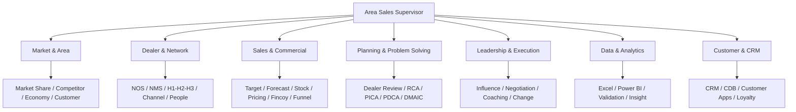

# 🗺 Peta Dunia Kerja

## Peta singkat

## Cara membacanya

Role ASS berada di tengah karena satu business problem hampir selalu menyentuh beberapa domain sekaligus.

Contoh: **AT High market share turun** tidak otomatis berarti perlu promo.

Pertanyaan awal dapat mencakup:

- market/segment/area;
- competitor;
- dealer contribution;
- stock;
- pricing/financing;
- sales-force productivity;
- activity effectiveness;
- funnel conversion;
- customer/CRM;
- NOS/process execution;
- action plan dan control.

WorkDesk harus membantu menghubungkan domain-domain tersebut, bukan menjawab secara silo.
